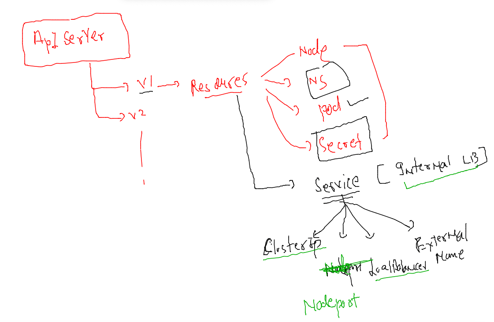
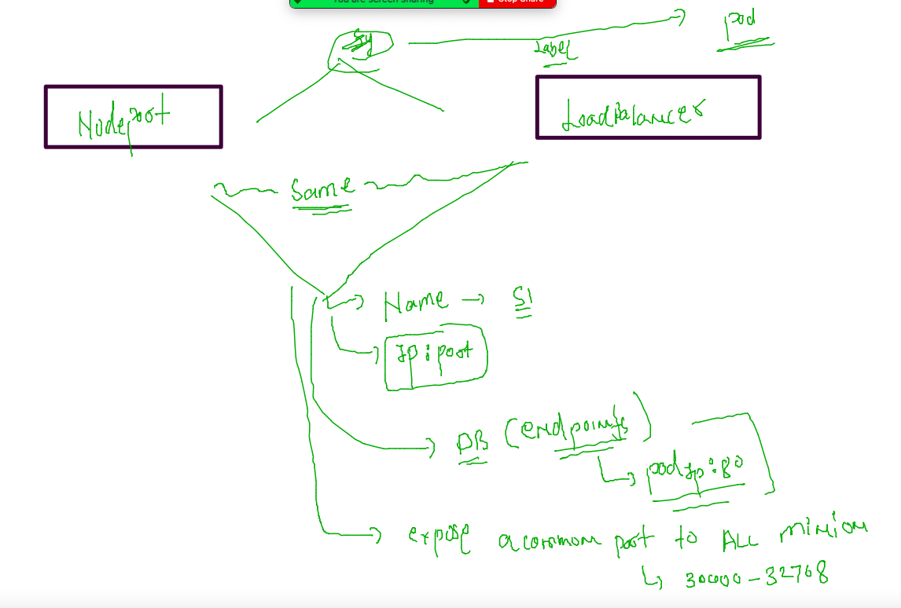
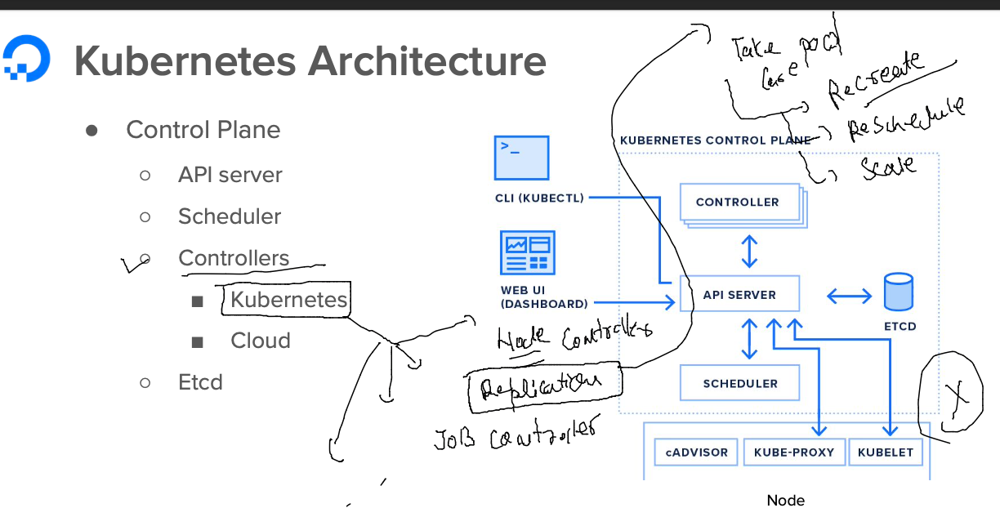
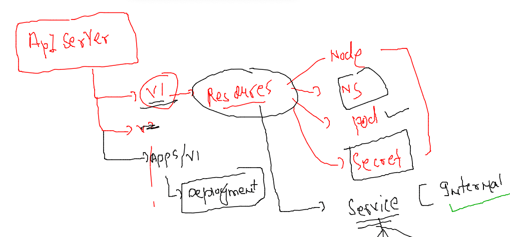
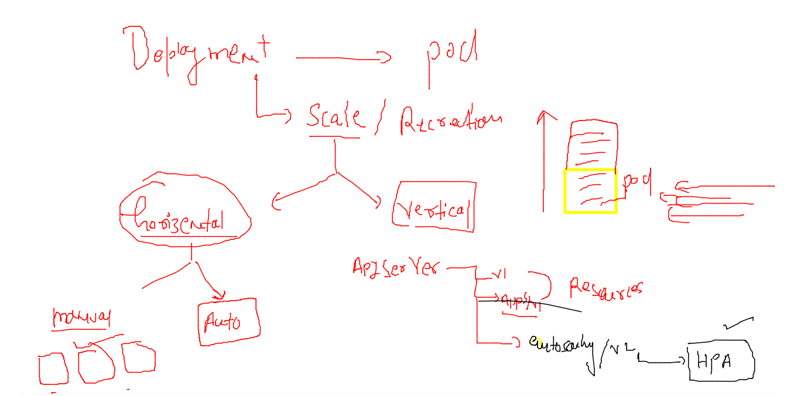
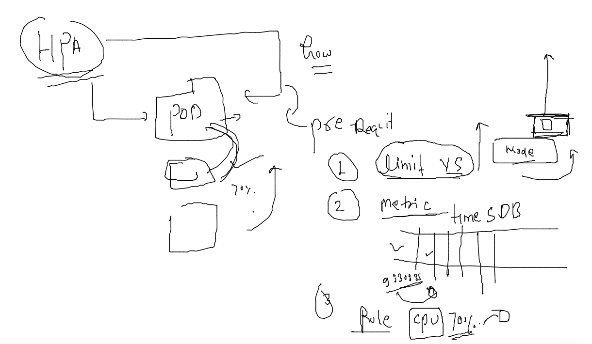

# training_plan 


### kubernetes namepsace resources deletion 

```
kubectl  get  all
No resources found in ashu-oci namespace.
fire@ashutoshhs-MacBook-Air ~ % kubectl  delete all --all
No resources found
fire@ashutoshhs-MacBook-Air ~ % 

```

### MULTI stage dockerfile 

### dockerfile with java app example 

```
FROM oraclelinux:8.4 AS Stage1 
LABEL email=ashutoshh@linux.com
RUN yum  install java-1.8.0-openjdk.x86_64 java-1.8.0-openjdk-devel.x86_64 maven  -y  ## layer ID 3453094545
COPY  . /javaweb/
WORKDIR /javaweb
RUN mvn clean package 
# above step for building javawebapp to .war file 

FROM tomcat 
LABEL name=ashutoshh
COPY --from=Stage1  /javaweb/target/WebApp.war /usr/local/tomcat/webapps/
# default location for java apps
EXPOSE 8080
```
### k8s networking again 
### deploy pod in personal namespace 
```
kubectl  create  -f  auto.yaml 
pod/ashupod555 created
fire@ashutoshhs-MacBook-Air k8s_app_deploy % kubectl  get  pods
NAME         READY   STATUS    RESTARTS   AGE
ashupod555   1/1     Running   0          5s
fire@ashutoshhs-MacBook-Air k8s_app_deploy % kubectl  get  pods -owide
NAME         READY   STATUS    RESTARTS   AGE   IP                NODE      NOMINATED NODE   READINESS GATES
ashupod555   1/1     Running   0          14s   192.168.179.246   minion2   <none>           <none>
fire@ashutoshhs-MacBook-Air k8s_app_deploy % 


```

### creating access pod to test internal networking 

```
kubectl  create  ns  app-access 
namespace/app-access created
fire@ashutoshhs-MacBook-Air ~ % 
fire@ashutoshhs-MacBook-Air ~ % 
fire@ashutoshhs-MacBook-Air ~ % kubectl  run  app-client --image=busybox  --command sleep 1000000 -n  app-access
pod/app-client created
fire@ashutoshhs-MacBook-Air ~ % kubectl  get  po -n app-access 
NAME         READY   STATUS    RESTARTS   AGE
app-client   1/1     Running   0          9s
fire@ashutoshhs-MacBook-Air ~ % kubectl  -n app-access exec -it  app-client -- sh 
/ # 
/ # 
/ # curl http://192.168.179.246:80 
sh: curl: not found
/ # wget  http://192.168.179.246:80
Connecting to 192.168.179.246:80 (192.168.179.246:80)
saving to 'index.html'
index.html           100% |****************************************************************************|  2866  0:00:00 ETA
'index.html' saved
/ # 


```

## accessing pod application 

### case 1 :- from k8s client system 


###

```
kubectl  port-forward  ashupod555  1234:80 
Forwarding from 127.0.0.1:1234 -> 80
Forwarding from [::1]:1234 -> 80
Handling connection for 1234

```

### case2 👎  when application is access by non k8s engg 

### Intro to Internal LB inside k8s minion_nodes


### Internal Lb will be using label of app to find all related pods 


### checking and changing label of pod 

```
kubectl  get po 
NAME         READY   STATUS    RESTARTS   AGE
ashupod555   1/1     Running   0          23m
fire@ashutoshhs-MacBook-Air k8s_app_deploy % kubectl  get po  --show-labels
NAME         READY   STATUS    RESTARTS   AGE   LABELS
ashupod555   1/1     Running   0          23m   run=ashupod555
fire@ashutoshhs-MacBook-Air k8s_app_deploy % kubectl  get po  --show-labels
NAME         READY   STATUS    RESTARTS   AGE   LABELS
ashupod555   1/1     Running   0          24m   run=ashupod555
fire@ashutoshhs-MacBook-Air k8s_app_deploy % kubectl  create -f  auto.yaml 
Error from server (AlreadyExists): error when creating "auto.yaml": pods "ashupod555" already exists
fire@ashutoshhs-MacBook-Air k8s_app_deploy % kubectl  get po  --show-labels
NAME         READY   STATUS    RESTARTS   AGE   LABELS
ashupod555   1/1     Running   0          24m   run=ashupod555
fire@ashutoshhs-MacBook-Air k8s_app_deploy % kubectl  apply  -f  auto.yaml
Warning: resource pods/ashupod555 is missing the kubectl.kubernetes.io/last-applied-configuration annotation which is required by kubectl apply. kubectl apply should only be used on resources created declaratively by either kubectl create --save-config or kubectl apply. The missing annotation will be patched automatically.
pod/ashupod555 configured
fire@ashutoshhs-MacBook-Air k8s_app_deploy % kubectl  get po  --show-labels
NAME         READY   STATUS    RESTARTS   AGE   LABELS
ashupod555   1/1     Running   0          25m   run=ashupod555,x=helloashu
```
### creating Internal LB using service Resource in k8s 



### Nodeport and Loadbalancer 


### Deploy Nodeport service type 

### check pod status 

```
 kubectl apply -f auto.yaml 
pod/ashupod5557 created
fire@ashutoshhs-MacBook-Air k8s_app_deploy % kubectl  get po -owide
NAME          READY   STATUS    RESTARTS   AGE   IP               NODE      NOMINATED NODE   READINESS GATES
ashupod5557   1/1     Running   0          7s    192.168.50.254   minion3   <none>           <none>
fire@ashutoshhs-MacBook-Air k8s_app_deploy % kubectl  get po --show-labels
NAME          READY   STATUS    RESTARTS   AGE   LABELS
ashupod5557   1/1     Running   0          13s   run=ashupod555,x=helloashu1
fire@ashutoshhs-MacBook-Air k8s_app_deploy % 

```

### creating nodeport service 

```
kubectl  create  service  nodeport  ashusvc1 --tcp 1234:80  --dry-run=client -o yaml >a
shulb1.yaml 
```

### creating service without matching podselector label 

```
fire@ashutoshhs-MacBook-Air k8s_app_deploy % kubectl  get po --show-labels
NAME          READY   STATUS    RESTARTS   AGE     LABELS
ashupod5557   1/1     Running   0          7m29s   run=ashupod555,x=helloashu1
fire@ashutoshhs-MacBook-Air k8s_app_deploy % 
fire@ashutoshhs-MacBook-Air k8s_app_deploy % kubectl  apply -f  ashulb1.yaml 
service/ashusvc1 created
fire@ashutoshhs-MacBook-Air k8s_app_deploy % kubectl   get service 
NAME       TYPE       CLUSTER-IP      EXTERNAL-IP   PORT(S)          AGE
ashusvc1   NodePort   10.104.28.219   <none>        1234:31574/TCP   17s
fire@ashutoshhs-MacBook-Air k8s_app_deploy % 
fire@ashutoshhs-MacBook-Air k8s_app_deploy %                       
fire@ashutoshhs-MacBook-Air k8s_app_deploy % 
fire@ashutoshhs-MacBook-Air k8s_app_deploy % kubectl   get endpoints 
NAME       ENDPOINTS   AGE
ashusvc1   <none>      68s
```

### now matching label and finding ep 

```
kubectl apply -f  ashulb1.yaml
service/ashusvc1 configured
fire@ashutoshhs-MacBook-Air k8s_app_deploy % kubectl  get  svc -o wide     
NAME       TYPE       CLUSTER-IP      EXTERNAL-IP   PORT(S)          AGE   SELECTOR
ashusvc1   NodePort   10.104.28.219   <none>        1234:31574/TCP   9m    run=ashupod555,x=helloashu1
fire@ashutoshhs-MacBook-Air k8s_app_deploy % kubectl  get po -o wide       
NAME          READY   STATUS    RESTARTS   AGE   IP               NODE      NOMINATED NODE   READINESS GATES
ashupod5557   1/1     Running   0          21m   192.168.50.254   minion3   <none>           <none>
fire@ashutoshhs-MacBook-Air k8s_app_deploy % kubectl  get  ep       
NAME       ENDPOINTS           AGE
ashusvc1   192.168.50.254:80   9m19s
fire@ashutoshhs-MacBook-Air k8s_app_deploy % 
```

### solution 

```
kubectl  get po -o wide
 1117  kubectl  get svc
 1118  kubectl  delete all --all
 1119  kubectl  run   ashutoshhwebapp --image=httpd --dry-run=client -o yaml >q2.yaml 
 1120  kubectl  get no
 1121  kubectl apply -f q2.yaml
 1122  kubectl  get po
 1123  kubectl  logs  ashutoshhwebapp
 1124  kubectl  logs  ashutoshhwebapp  >logs.txt
 1125  ls
 1126  kubectl  exec -it ashutoshhwebapp  -- bash 
 1127  kubectl cp  logs.txt  ashutoshhwebapp:/oracle/
 1128  kubectl  exec -it ashutoshhwebapp  -- bash 
 1129  kubectl  exec -it ashutoshhwebapp  -- bash 
 1130  kubectl  logs  ashutoshhwebapp  >logs.txt
 1131  kubectl  logs  ashutoshhwebapp  
```

## Controllers in kubernetes -- 



### Deployment in k8s 

```
kubectl  create  deployment  ashuapp --image=docker.io/dockerashu/ashuwebapp:apr25v1  -
-port 80 --dry-run=client  -o yaml  >deployment.yaml
```

### new apiversion in k8s for deployment 



### creating POD using deployment 

```
 kubectl  apply -f  deployment.yaml 
deployment.apps/ashuapp created
fire@ashutoshhs-MacBook-Air k8s_app_deploy % kubectl  get deploy
NAME      READY   UP-TO-DATE   AVAILABLE   AGE
ashuapp   1/1     1            1           13s
fire@ashutoshhs-MacBook-Air k8s_app_deploy % kubectl  get  po
NAME                       READY   STATUS    RESTARTS   AGE
ashuapp-6758d7b585-57mmq   1/1     Running   0          82s
fire@ashutoshhs-MacBook-Air k8s_app_deploy % kubectl  get  po -o wide
NAME                       READY   STATUS    RESTARTS   AGE    IP               NODE      NOMINATED NODE   READINESS GATES
ashuapp-6758d7b585-57mmq   1/1     Running   0          102s   192.168.50.218   minion3   <none>           <none>
fire@ashutoshhs-MacBook-Air k8s_app_deploy % kubectl  delete pod ashuapp-6758d7b585-57mmq
pod "ashuapp-6758d7b585-57mmq" deleted
fire@ashutoshhs-MacBook-Air k8s_app_deploy % kubectl  get  po -o wide                    
NAME                       READY   STATUS    RESTARTS   AGE   IP               NODE      NOMINATED NODE   READINESS GATES
ashuapp-6758d7b585-xgw5s   1/1     Running   0          8s    192.168.50.221   minion3   <none>           <none>
fire@ashutoshhs-MacBook-Air k8s_app_deploy % 


```

### creating service using expose command 

```
kubectl  expose deployment  ashuapp  --type NodePort --port 80 --name ashulb 
service/ashulb exposed
fire@ashutoshhs-MacBook-Air k8s_app_deploy % kubectl  get  svc
NAME     TYPE       CLUSTER-IP     EXTERNAL-IP   PORT(S)        AGE
ashulb   NodePort   10.98.152.74   <none>        80:32756/TCP   11s
fire@ashutoshhs-MacBook-Air k8s_app_deploy % kubectl  get  ep
NAME     ENDPOINTS           AGE
ashulb   192.168.50.221:80   29s
```

### np and LB service are same as of now 

```
kubectl  expose deployment  ashuapp  --type LoadBalancer --port 80 --name ashulb2
service/ashulb2 exposed
fire@ashutoshhs-MacBook-Air k8s_app_deploy % kubectl  get  svc
NAME      TYPE           CLUSTER-IP      EXTERNAL-IP   PORT(S)        AGE
ashulb    NodePort       10.98.152.74    <none>        80:32756/TCP   2m17s
ashulb2   LoadBalancer   10.96.127.237   <pending>     80:30231/TCP   5s
fire@ashutoshhs-MacBook-Air k8s_app_deploy % kubectl  get  ep                                                                 
NAME      ENDPOINTS           AGE
ashulb    192.168.50.221:80   2m21s
ashulb2   192.168.50.221:80   9s
```
### Horizental pod scaling 

### manual 

```
 kubectl  scale deployment  ashuapp --replicas=3
 
fire@ashutoshhs-MacBook-Air k8s_app_deploy % kubectl get po -o wide
NAME                       READY   STATUS    RESTARTS   AGE    IP                NODE      NOMINATED NODE   READINESS GATES
ashuapp-6758d7b585-q7tmx   1/1     Running   0          100s   192.168.179.217   minion2   <none>           <none>
ashuapp-6758d7b585-v8hnz   1/1     Running   0          100s   192.168.166.180   node1     <none>           <none>
ashuapp-6758d7b585-xgw5s   1/1     Running   0          18m    192.168.50.221    minion3   <none>           <none>
fire@ashutoshhs-MacBook-Air k8s_app_deploy % kubectl get svc 
NAME     TYPE       CLUSTER-IP     EXTERNAL-IP   PORT(S)        AGE
ashulb   NodePort   10.98.152.74   <none>        80:32756/TCP   14m
fire@ashutoshhs-MacBook-Air k8s_app_deploy % kubectl get ep 
NAME     ENDPOINTS                                                 AGE
ashulb   192.168.166.180:80,192.168.179.217:80,192.168.50.221:80   14m
```

### HPA in k8s 



###



### Deploy the deployment 

```
kubectl apply -f deployment.yaml 
deployment.apps/ashuapp created
fire@ashutoshhs-MacBook-Air k8s_app_deploy % kubectl  get deploy 
NAME      READY   UP-TO-DATE   AVAILABLE   AGE
ashuapp   1/1     1            1           27m
fire@ashutoshhs-MacBook-Air k8s_app_deploy % kubectl get po
NAME                       READY   STATUS    RESTARTS   AGE
ashuapp-868fc9dfdf-v9xqq   1/1     Running   0          27m
```

### deploy metric server 

```
kubectl  apply -f https://raw.githubusercontent.com/redashu/k8s/hpa/hpa/components.yaml
serviceaccount/metrics-server unchanged
clusterrole.rbac.authorization.k8s.io/system:aggregated-metrics-reader unchanged
clusterrole.rbac.authorization.k8s.io/system:metrics-server unchanged
rolebinding.rbac.authorization.k8s.io/metrics-server-auth-reader unchanged
clusterrolebinding.rbac.authorization.k8s.io/metrics-server:system:auth-delegator unchanged
clusterrolebinding.rbac.authorization.k8s.io/system:metrics-server unchanged
service/metrics-server unchanged
deployment.apps/metrics-server configured
apiservice.apiregistration.k8s.io/v1beta1.metrics.k8s.io unchanged
fire@ashutoshhs-MacBook-Air Desktop % 
fire@ashutoshhs-MacBook-Air Desktop % 
fire@ashutoshhs-MacBook-Air Desktop % kubectl  get po -n kube-system 
NAME                                      READY   STATUS    RESTARTS      AGE
calico-kube-controllers-7c845d499-drpx4   1/1     Running   4 (8h ago)    10d
calico-node-dvc2j                         1/1     Running   1 (8h ago)    28h
calico-node-q6xgd                         1/1     Running   4 (8h ago)    10d
calico-node-sl28x                         1/1     Running   4 (8h ago)    10d
calico-node-t96pj                         1/1     Running   1 (8h ago)    28h
coredns-64897985d-l872g                   1/1     Running   4 (8h ago)    10d
coredns-64897985d-ld4c9                   1/1     Running   4 (8h ago)    10d
etcd-control-plane                        1/1     Running   4 (8h ago)    10d
kube-apiserver-control-plane              1/1     Running   7 (8h ago)    10d
kube-controller-manager-control-plane     1/1     Running   4 (8h ago)    10d
kube-proxy-6hnq6                          1/1     Running   4 (8h ago)    10d
kube-proxy-d9hsf                          1/1     Running   1 (8h ago)    28h
kube-proxy-gqhvl                          1/1     Running   4 (8h ago)    10d
kube-proxy-wvbcr                          1/1     Running   1 (8h ago)    28h
kube-scheduler-control-plane              1/1     Running   4 (8h ago)    10d
metrics-server-5c69db44f5-69ctm           1/1     Running   5 (86m ago)   10d
```

### source info for metric server 

[link](https://github.com/kubernetes-sigs/metrics-server)


### Deployment of hpa 

```
kubectl  get deploy 
NAME      READY   UP-TO-DATE   AVAILABLE   AGE
ashuapp   1/1     1            1           28m
fire@ashutoshhs-MacBook-Air k8s_app_deploy % kubectl get  svc
No resources found in ashu-oci namespace.
fire@ashutoshhs-MacBook-Air k8s_app_deploy % kubectl expose deployment  ashuapp --type NodePort --port 80 --name s1 
service/s1 exposed
fire@ashutoshhs-MacBook-Air k8s_app_deploy % kubectl get svc
NAME   TYPE       CLUSTER-IP      EXTERNAL-IP   PORT(S)        AGE
s1     NodePort   10.99.125.133   <none>        80:31715/TCP   4s
fire@ashutoshhs-MacBook-Air k8s_app_deploy % 
fire@ashutoshhs-MacBook-Air k8s_app_deploy % kubectl autoscale deployment ashuapp --min=2 --max=10 --cpu-percent=5 
horizontalpodautoscaler.autoscaling/ashuapp autoscaled
fire@ashutoshhs-MacBook-Air k8s_app_deploy % kubectl  get  hpa
NAME      REFERENCE            TARGETS        MINPODS   MAXPODS   REPLICAS   AGE
ashuapp   Deployment/ashuapp   <unknown>/5%   2         10        0          4s
fire@ashutoshhs-MacBook-Air k8s_app_deploy % kubectl  get  hpa
NAME      REFERENCE            TARGETS   MINPODS   MAXPODS   REPLICAS   AGE
ashuapp   Deployment/ashuapp   1%/5%     2         10        2          75s
fire@ashutoshhs-MacBook-Air k8s_app_deploy % kubectl  get deploy                                                    
NAME      READY   UP-TO-DATE   AVAILABLE   AGE
ashuapp   2/2     2            2           31m
```
### to test hap we can use this script inside k8s 

```
kubectl  run attack -it --rm  --image=busybox --command sh 
If you don't see a command prompt, try pressing enter.
/ # 
/ # 
/ # while sleep 0.01; do wget -q -O- http://php-apache; done^C
/ # 

```


