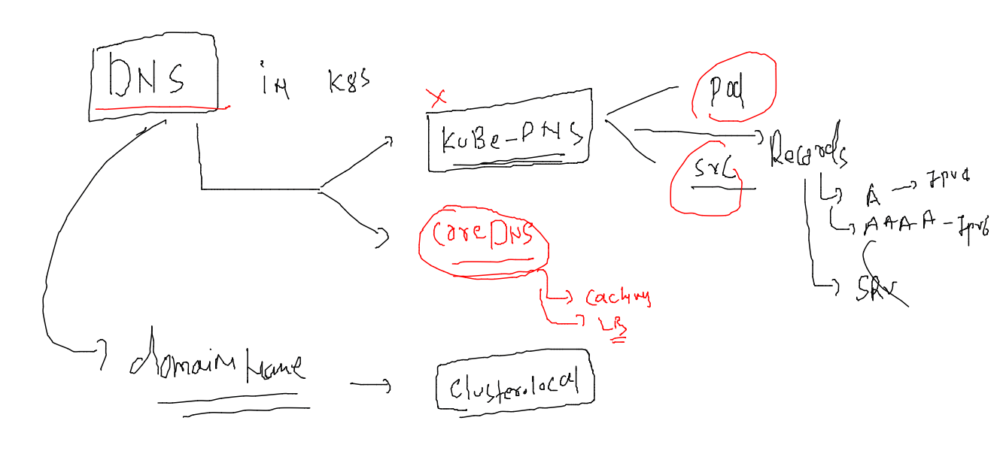

# training_plan 


### kubectl cheat sheet 

[cheat_sheet](https://kubernetes.io/docs/reference/kubectl/cheatsheet/)

### clean up namespace data

```
 kubectl  delete   all --all
pod "ashuapp-868fc9dfdf-6hvhm" deleted
pod "ashuapp-868fc9dfdf-qfrmz" deleted
service "s1" deleted
deployment.apps "ashuapp" deleted
horizontalpodautoscaler.autoscaling "ashuapp" deleted
```


### DNS in k8s 



### checking dns in k8s 

```
kubectl  get  pods -n kube-system   |   grep -i dns
coredns-64897985d-l872g                   1/1     Running   5 (17h ago)   11d
coredns-64897985d-ld4c9                   1/1     Running   5 (17h ago)   11d
```

## testing DNS in single namespace 

### deploy app using deployment 

```
kubectl  apply -f  deployment.yaml 
deployment.apps/ashuapp created
fire@ashutoshhs-MacBook-Air k8s_app_deploy % kubectl  get deploy 
NAME      READY   UP-TO-DATE   AVAILABLE   AGE
ashuapp   1/1     1            1           4s
fire@ashutoshhs-MacBook-Air k8s_app_deploy % kubectl  get  po -owide
NAME                       READY   STATUS    RESTARTS   AGE   IP               NODE      NOMINATED NODE   READINESS GATES
ashuapp-868fc9dfdf-s678j   1/1     Running   0          11s   192.168.50.216   minion3   <none>           <none>
fire@ashutoshhs-MacBook-Air k8s_app_deploy % 

```

### deploy nodeport / Loadbalancer svc 

```
 kubectl  get  deploy 
NAME      READY   UP-TO-DATE   AVAILABLE   AGE
ashuapp   1/1     1            1           3m51s
fire@ashutoshhs-MacBook-Air k8s_app_deploy % kubectl  expose deployment  ashuapp  --type NodePort  --port 1234 --target-port 80 --na
me  ashulb1 
service/ashulb1 exposed
fire@ashutoshhs-MacBook-Air k8s_app_deploy % kubectl  get  svc
NAME      TYPE       CLUSTER-IP     EXTERNAL-IP   PORT(S)          AGE
ashulb1   NodePort   10.96.160.47   <none>        1234:30394/TCP   52s
```
### testing access from Internal 

```
 kubectl  run  webclient --image=busybox --command sleep inf 
pod/webclient created
fire@ashutoshhs-MacBook-Air ~ % kubectl  get  po
NAME                       READY   STATUS    RESTARTS   AGE
ashuapp-868fc9dfdf-s678j   1/1     Running   0          7m30s
webclient                  1/1     Running   0          4s
fire@ashutoshhs-MacBook-Air ~ % 

```

### accessing page 

```
kubectl  exec  -it webclient -- sh 
/ # 
/ # wget  http://ashulb1 
Connecting to ashulb1 (10.96.160.47:80)
^C
/ # wget  http://ashulb1:1234 
Connecting to ashulb1:1234 (10.96.160.47:1234)
saving to 'index.html'
index.html           100% |****************************************************************************|  2866  0:00:00 ETA
'index.html' saved

```

### accessing svc from different namespace pod 

```

fire@ashutoshhs-MacBook-Air ~ % kubectl  run  webclient --image=busybox --command sleep inf  -n app-access 
pod/webclient created
fire@ashutoshhs-MacBook-Air ~ % 
fire@ashutoshhs-MacBook-Air ~ % kubectl  -n app-access exec -it  webclient -- sh 
/ # 
/ # wget http://ashulb
wget: bad address 'ashulb'
/ # wget http://ashulb1
wget: bad address 'ashulb1'
/ # 
/ # wget http://ashulb1
wget: bad address 'ashulb1'
/ # wget http://ashulb1.ashu-oci.svc.cluster.local
Connecting to ashulb1.ashu-oci.svc.cluster.local (10.96.116.145:80)
saving to 'index.html'
index.html           100% |****************************************************************************|  2866  0:00:00 ETA
'index.html' saved
/ # 
/ # cat  /etc/resolv.conf 
nameserver 10.96.0.10
search app-access.svc.cluster.local svc.cluster.local cluster.local ec2.internal
options ndots:5

```


