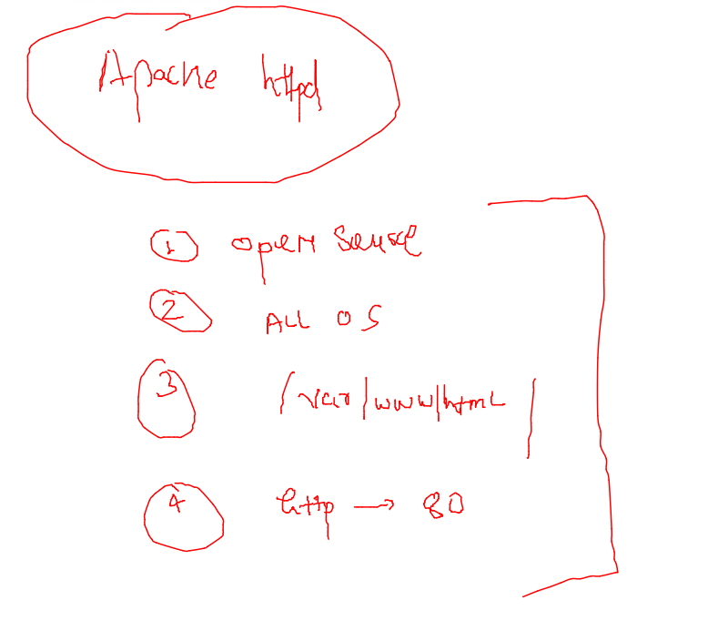
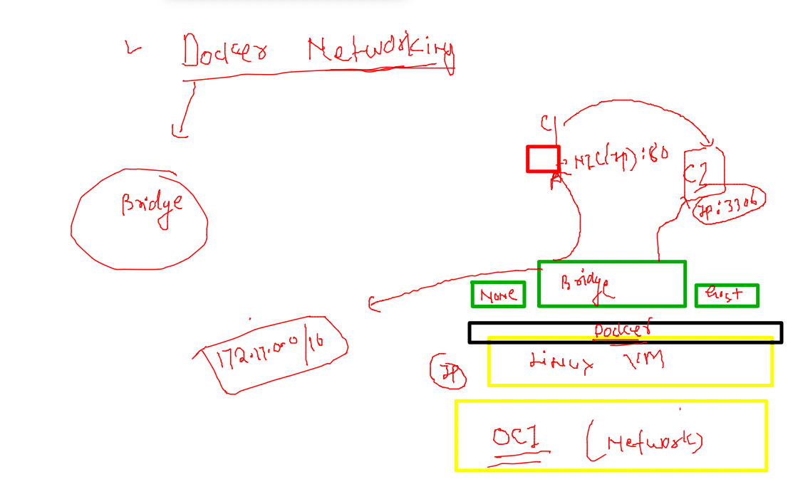

# training_plan 


## OCI (open container Initiative ) Understanding 


### lInk to read about OCI 

(Link)(https://opencontainers.org/)

## Installing docker in Linux Host 


### Installing docker in aws linux on AWS cloud 

```
[root@ip-172-31-18-125 ~]# yum  install docker  -y  ; systemctl enable --now docker 
Failed to set locale, defaulting to C
Loaded plugins: extras_suggestions, langpacks, priorities, update-motd
Resolving Dependencies
--> Running transaction check
---> Package docker.x86_64 0:20.10.7-5.amzn2 will be installed
--> Processing Dependency: runc >= 1.0.0 for package: docker-20.10.7-5.amzn2.x86_64
--> Processing Dependency: libcgroup >= 0.40.rc1-5.15 for package: docker-20.10.7-5.amzn2.x86_64
--> Processing Dependency: containerd >= 1.3.2 for package: docker-20.10.7-5.amzn2.x86_64
--> Processing Dependency: pigz for
```

### ON OCI -- in oracle linux 7.9 

```
root@docker-linux-host1 ~]# yum  install docker -y   ; systemctl enable --now docker 
Failed to set locale, defaulting to C
Loaded plugins: langpacks, ulninfo
ol7_MySQL80                                                                                         | 3.0 kB  00:00:00     
ol7_MySQL80_connectors_community                                                                    | 2.9 kB  00:00:00     
ol7_MySQL80_tools_community                                                                         | 2.9 kB  00:00:00     
ol7_UEKR6                                                                                           | 3.0 kB  00:00:00     
ol7_addons                                                                                          | 3.0 kB  00:00:00     
ol7_ksplice                                                                                         | 3.0 kB  00:00:00     
ol7_latest                                                                                          | 3.6 kB  00:00:00     
ol7_oci_included         
```

### now checking installation 

```
root@docker-linux-host1 ~]# yum  install docker -y   ; systemctl enable --now docker 
Failed to set locale, defaulting to C
Loaded plugins: langpacks, ulninfo
ol7_MySQL80                                                                                         | 3.0 kB  00:00:00     
ol7_MySQL80_connectors_community                                                                    | 2.9 kB  00:00:00     
ol7_MySQL80_tools_community                                                                         | 2.9 kB  00:00:00     
ol7_UEKR6                                                                                           | 3.0 kB  00:00:00     
ol7_addons                                                                                          | 3.0 kB  00:00:00     
ol7_ksplice                                                                                         | 3.0 kB  00:00:00     
ol7_latest                                                                                          | 3.6 kB  00:00:00     
ol7_oci_included         
```

### login to OCI VM and using docker 

```
ssh  ashu@158.101.16.187                               
ashu@158.101.16.187's password: 
-bash: warning: setlocale: LC_CTYPE: cannot change locale (UTF-8): No such file or directory
[ashu@docker-linux-host1 ~]$ 
[ashu@docker-linux-host1 ~]$ 
[ashu@docker-linux-host1 ~]$ whoami
ashu
[ashu@docker-linux-host1 ~]$ docker  version 
Client: Docker Engine - Community
 Version:           19.03.11-ol
 API version:       1.40
 Go version:        go1.16.2
 Git commit:        9bb540d
 Built:             Fri Jul 23 01:33:55 2021
 OS/Arch:           linux/amd64
 Experimental:      false

```

### add non root user to use docker 

```
[root@docker-linux-host1 ~]# useradd sag
[root@docker-linux-host1 ~]# usermod -aG docker sag
[root@docker-linux-host1 ~]# echo "OracleTr098#"  |  passwd sag --stdin 
```

### FROm client -- / dev / admin laptops we will be using vscode to connect docker and k8s 

### Download vscode link

[download](https://code.visualstudio.com/download)

### Docker. architecture 


## Some docker OPerations 

### pulling image from docker hub 

```
 docker  images
REPOSITORY          TAG                 IMAGE ID            CREATED             SIZE
[ashu@docker-linux-host1 ~]$ docker  pull  openjdk 
Using default tag: latest
Trying to pull repository docker.io/library/openjdk ... 
latest: Pulling from docker.io/library/openjdk
e4430e06691f: Pull complete 
99ce5342b806: Pull complete 
603e156f2a3d: Pull complete 
Digest: sha256:e914d4e97cc467f99befdc751e1fa1b6c9ec77fc9396caae2e37c48c9e44a681
Status: Downloaded newer image for openjdk:latest
openjdk:latest
[ashu@docker-linux-host1 ~]$ docker  images
REPOSITORY          TAG                 IMAGE ID            CREATED             SIZE
openjdk             latest              34aba91dbd13        3 weeks ago         471MB
```

### checking list of image in docker host 

```
[ashu@docker-linux-host1 ~]$ docker  images
REPOSITORY          TAG                 IMAGE ID            CREATED             SIZE
alpine              latest              0ac33e5f5afa        2 weeks ago         5.57MB
openjdk             latest              34aba91dbd13        3 weeks ago         471MB
```

### APP containerization 


### taking sample html webapp 

```
git clone https://github.com/microsoft/project-html-website

```

### creating dockerfile where dockerfile will have 

<ol>
 <li> Os Libs </li>
 <li> any app server </li>
 <li> source code of app </li>
</ol>

### apache webserver 



### Dockerfile 

```
FROM oraclelinux:8.4 
# to run my webapp we need some base image 
LABEL email=ashutoshh@linux.com 
# sharing contact info with docker image users {optional part}
RUN yum install httpd -y 
# installing httpd inside oraclelinux image 
COPY  . /var/www/html/
# copy all the data from dockerfile location to /var/www/html/ in new image
EXPOSE 80 
# apache httpd default port for http request
ENTRYPOINT  httpd -DFOREGROUND
# we are using to start process during container creation

```

### .dockerignore 

```
 Dockerfile
.dockerignore
LICENSE
README.md
.git
```

### building docker image

```
docker build -t ashuwebapp:apr25v1 . 
Sending build context to Docker daemon  833.5kB
Step 1/6 : FROM oraclelinux:8.4
Trying to pull repository docker.io/library/oraclelinux ... 
8.4: Pulling from docker.io/library/oraclelinux
a4df6f21af84: Pull complete 
Digest: sha256:b81d5b0638bb67030b207d28586d0e714a811cc612396dbe3410db406998b3ad
Status: Image is up to date for oraclelinux:8.4
 ---> 97e22ab49eea
Step 2/6 : LABEL email=ashutoshh@linux.com
 ---> Running in f91d683f0a19
Removing intermediate container f91d683f0a19
```

### checking images

```
[ashu@docker-linux-host1 project-html-website]$ docker  images
REPOSITORY          TAG                 IMAGE ID            CREATED             SIZE
sudhakarapp         apr25thv1           9474656b71d3        5 seconds ago       419MB
<none>              <none>              35d40d4fbf3b        12 seconds ago      246MB
muskanwebapp        apr25v1             2c51dff1a225        40 seconds ago      419MB
arunwebapp          apr25day1           3fa2c6f22f12        40 seconds ago      419MB
vedeshwebapp        apr25v1             bbefe79744be        42 seconds ago      419MB
mywebpage           v1.0
```
### docker networking understanding

### default docker networks 



### list of netowrks 

```
docker  network ls
NETWORK ID          NAME                DRIVER              SCOPE
1a3c640ac0bc        bridge              bridge              local
fb279736346d        host                host                local
3cd58c9da33f        none                null                local
[ashu@docker-linux-host1 project-html-website]$ 
```

### understanding bridge

```
docker  network inspect  bridge 
[
    {
        "Name": "bridge",
        "Id": "1a3c640ac0bc6cf89468bf1c99b55aee38a9b0d1252c586f911fe801702a56a5",
        "Created": "2022-04-25T05:00:30.826047371Z",
        "Scope": "local",
        "Driver": "bridge",
        "EnableIPv6": false,
        "IPAM": {
            "Driver": "default",
            "Options": null,
            "Config": [
                {
                    "Subnet": "172.17.0.0/16"
                }
            ]
        },
        "Internal": false,
        "Attachable": false,
        "Ingress": false,
        "ConfigFrom": {
            "Network": ""
        },
        "ConfigOnly": false,
        "Containers": {},
        "Options": {
            "com.docker.network.bridge.default_bridge": "true",
            "com.docker.network.bridge.enable_icc": "true",
            "com.docker.network.bridge.enable_ip_masquerade": "true",
            "com.docker.network.bridge.host_binding_ipv4": "0.0.0.0",
            "com.docker.network.bridge.name": "docker0",
            "com.docker.network.driver.mtu": "1500"
        },
        "Labels": {}
    }
]
[ashu@docker-linux-host1 project-html-website]$ 
```

### creating first container 

```
docker run -itd --name  ashuwebc1 ashuwebapp:apr25v1
   30  history 
[ashu@docker-linux-host1 project-html-website]$ docker  ps
CONTAINER ID        IMAGE                COMMAND                  CREATED             STATUS              PORTS               NAMES
f377dee4e90e        ashuwebapp:apr25v1   "/bin/sh -c 'httpd -…"   5 seconds ago       Up 3 seconds        80/tcp              ashuwebc1
```

### creating container with default parent process 
### 

```
 docker run -it --rm  --entrypoint bash  b978f1934272
```

### tip to remove all the non running container 

```
 docker rm $(docker ps -q -f status="exited")
```

### creating container with port farwording 

```
 docker  rm  ashuwebc1 -f
ashuwebc1
[ashu@docker-linux-host1 project-html-website]$ docker run -itd --name  ashuwebc1 -p  1234:80  ashuwebapp:apr25v1
```

