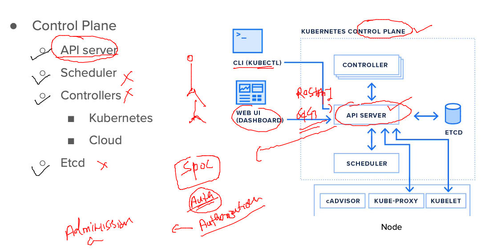
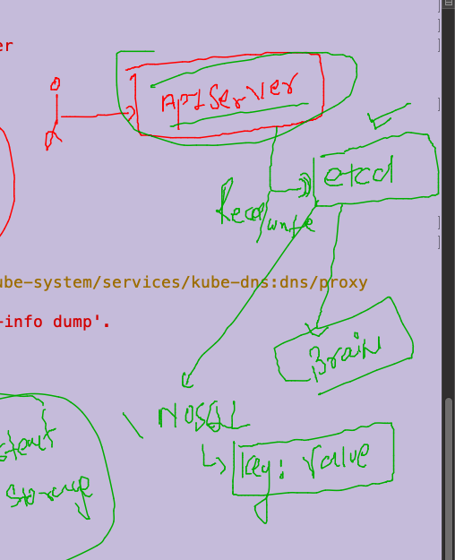
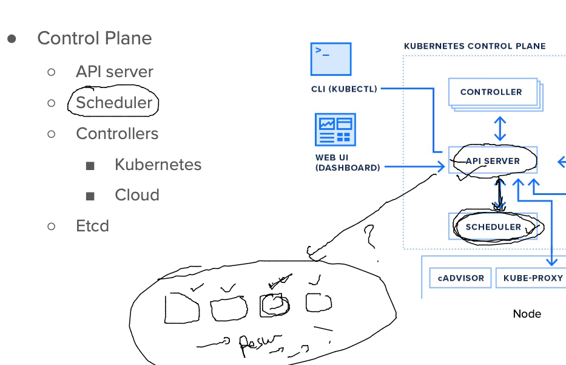
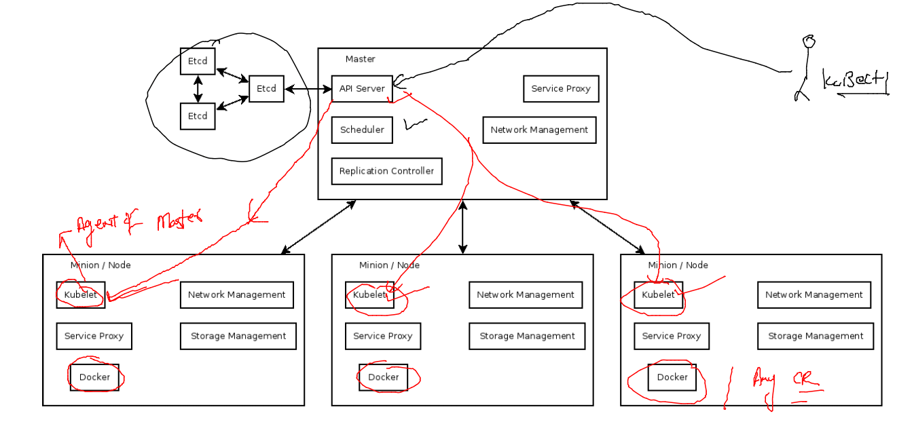
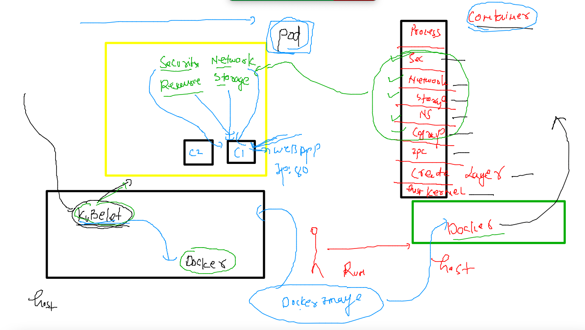
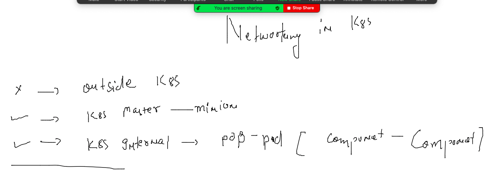
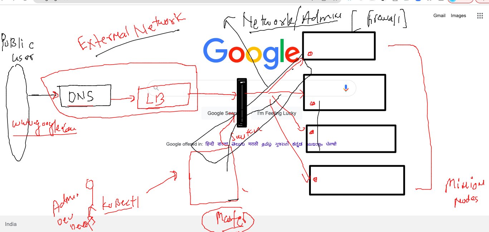
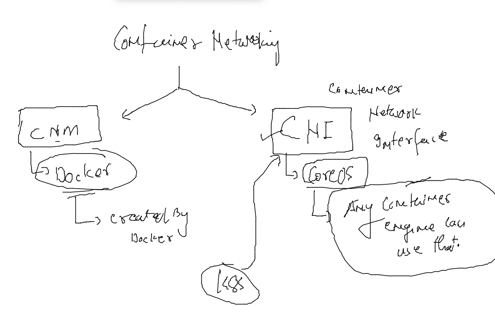
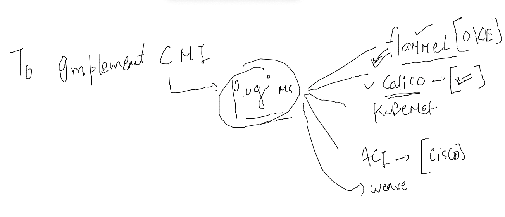
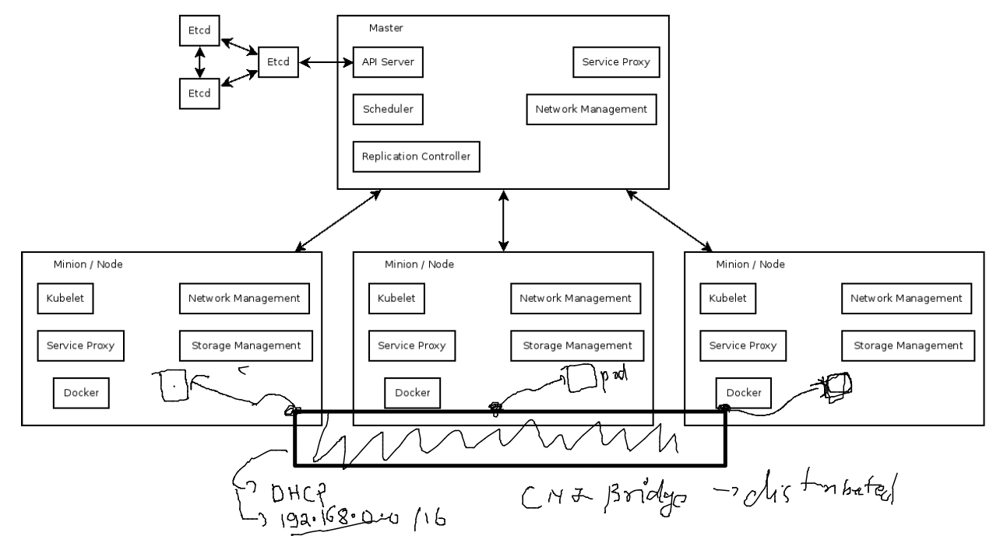

# training_plan 


### day1 revision 


### testing OCI standard 

```
[root@podman-host ~]# podman images
REPOSITORY  TAG         IMAGE ID    CREATED     SIZE
[root@podman-host ~]# podman pull  dockerashu/ashuwebapp/apr25v1
[root@podman-host ~]# podman pull  dockerashu/ashuwebapp/apr25v1
✔ docker.io/dockerashu/ashuwebapp/apr25v1:latest
Trying to pull docker.io/dockerashu/ashuwebapp/apr25v1:latest...
Error: initializing source docker://dockerashu/ashuwebapp/apr25v1:latest: reading manifest latest in docker.io/dockerashu/ashuwebapp/apr25v1: errors:
denied: requested access to the resource is denied
unauthorized: authentication required

[root@podman-host ~]# podman pull  docker.io/dockerashu/ashuwebapp:apr25v1
Trying to pull docker.io/dockerashu/ashuwebapp:apr25v1...
Getting image source signatures
Copying blob 32ace47e7ebf done  
Copying blob a4df6f21af84 done  
Copying blob 86d6207ad7cf done  
Copying config d9669ca17a done  
Writing manifest to image destination
Storing signatures
d9669ca17a853fe690e4027763f23ad1375c5dd25b3f5d31f7859f270c423a09
[root@podman-host ~]# podman images
REPOSITORY                       TAG         IMAGE ID      CREATED       SIZE
docker.io/dockerashu/ashuwebapp  apr25v1     d9669ca17a85  22 hours ago  427 MB
[root@podman-host ~]# podman run -itd  --name test1  -p 1133:80  d9669ca17a85
6103170a7b61a65b90fd4a2b7fa00e9b343f1c733497eeeba08abd83f87713cf
[root@podman-host ~]# podman ps
CONTAINER ID  IMAGE                                    COMMAND     CREATED        STATUS            PORTS                 NAMES
6103170a7b61  docker.io/dockerashu/ashuwebapp:apr25v1              4 seconds ago  Up 3 seconds ago  0.0.0.0:1133->80/tcp  test1
[root@podman-host ~]# 

```

### pushing image to OCIR 

```
 docker  tag  ashuwebapp:apr25v1   phx.ocir.io/axmbtg8judkl/oracleapp:v1 
[ashu@docker-linux-host1 ashu_docker_images]$ 
[ashu@docker-linux-host1 ashu_docker_images]$ 
[ashu@docker-linux-host1 ashu_docker_images]$ docker login  phx.ocir.io  
Username: axmbtg8judkl/learntechbyme@gmail.com
Password: 
WARNING! Your password will be stored unencrypted in /home/ashu/.docker/config.json.
Configure a credential helper to remove this warning. See
https://docs.docker.com/engine/reference/commandline/login/#credentials-store

Login Succeeded
[ashu@docker-linux-host1 ashu_docker_images]$ docker  push  phx.ocir.io/axmbtg8judkl/oracleapp:v1
The push refers to repository [phx.ocir.io/axmbtg8judkl/oracleapp]
32160d4b43c2: Pushed 
1698c557758b: Pushed 
2d3586eacb61: Pushing [=========================================>         ]  205.1MB/246.2MB

====

docker logout phx.ocir.io  
Removing login credentials for phx.ocir.io
[ashu@docker-linux-host1 ashu_docker_images]$ 

```

## to solve container Cluster problem -- we need k8s 

### architecture  -- 

### Level 1


### setup methods for k8s cluster 


### Installing kubeclt on client machine 

### On mac 

```
 curl -LO "https://dl.k8s.io/release/$(curl -L -s https://dl.k8s.io/release/stable.txt)/bin/darwin/amd64/kubectl"
  % Total    % Received % Xferd  Average Speed   Time    Time     Time  Current
                                 Dload  Upload   Total   Spent    Left  Speed
100   154  100   154    0     0    374      0 --:--:-- --:--:-- --:--:--   374
100 50.6M  100 50.6M    0     0  5077k      0  0:00:10  0:00:10 --:--:-- 6048k
fire@ashutoshhs-MacBook-Air ~ % chmod +x ./kubectl
fire@ashutoshhs-MacBook-Air ~ % sudo mv ./kubectl /usr/local/bin/kubectl
Password:
fire@ashutoshhs-MacBook-Air ~ % sudo chown root: /usr/local/bin/kubectl
fire@ashutoshhs-MacBook-Air ~ % 
fire@ashutoshhs-MacBook-Air ~ % kubectl  version --client
Client Version: version.Info{Major:"1", Minor:"23", GitVersion:"v1.23.6", GitCommit:"ad3338546da947756e8a88aa6822e9c11e7eac22", GitTreeState:"clean", BuildDate:"2022-04-14T08:49:13Z", GoVersion:"go1.17.9", Compiler:"gc", Platform:"darwin/amd64"}

```

### checking kubeconfig file to test k8s conection 

```

fire@ashutoshhs-MacBook-Air Desktop % kubectl   get  nodes  --kubeconfig admin.conf.txt 
NAME            STATUS   ROLES                  AGE   VERSION
control-plane   Ready    control-plane,master   9d    v1.23.5
node1           Ready    <none>                 9d    v1.23.5
fire@ashutoshhs-MacBook-Air Desktop % 
fire@ashutoshhs-MacBook-Air Desktop % 
fire@ashutoshhs-MacBook-Air Desktop % kubectl  cluster-info   --kubeconfig admin.conf.txt 
Kubernetes control plane is running at https://18.211.91.213:6443
CoreDNS is running at https://18.211.91.213:6443/api/v1/namespaces/kube-system/services/kube-dns:dns/proxy

To further debug and diagnose cluster problems, use 'kubectl cluster-info dump'.
fire@ashutoshhs-MacBook-Air Desktop % 


```

### saving file to home directory by the name of config 

```
 
fire@ashutoshhs-MacBook-Air Desktop % mkdir  ~/.kube
mkdir: /Users/fire/.kube: File exists
fire@ashutoshhs-MacBook-Air Desktop % cp  admin.conf.txt  ~/.kube/config 
fire@ashutoshhs-MacBook-Air Desktop % 
fire@ashutoshhs-MacBook-Air Desktop % kubectl  get nodes
NAME            STATUS   ROLES                  AGE   VERSION
control-plane   Ready    control-plane,master   9d    v1.23.5
node1           Ready    <none>                 9d    v1.23.5
```

## Control plane components

### api-server



### etcd 



### kube-schedular 



### Minion / worker side Components



### K8s -- pod Introduction 



### creating first pod file 

```
apiVersion: v1
kind: Pod
metadata:
  name: ashupod-123  # name of pod 
spec:
  containers:
  - name: ashuc1 # name of contianer 
    image: docker.io/dockerashu/ashuwebapp:apr25v1 # image from docker hub 
    ports: # app port number 
    - containerPort: 80
```

### checking syntax of file 

```
 kubectl create -f  ashuwebapp.yaml  --dry-run=client 
pod/ashupod-123 created (dry run)
fire@ashutoshhs-MacBook-Air k8s_app_deploy % 
```

### deploy pod file 

```
kubectl create -f  ashuwebapp.yaml                   
pod/ashupod-123 created
==
kubectl  get  pods
NAME             READY   STATUS              RESTARTS   AGE
ashupod-123      1/1     Running             0          12s
myapp-amit       1/1     Running             0          2m30s
santoshpod-123   0/1     ContainerCreating   0          7s
subbu-123        0/1     ContainerCreating   0          8s
vedeshpod-123    1/1     Running             0          8s

```
### delete pod 

```
kubectl  delete pod anandapod-123
pod "anandapod-123" deleted
```

### more details about pod 

```
kubectl  get  po -o wide
NAME             READY   STATUS    RESTARTS   AGE     IP                NODE      NOMINATED NODE   READINESS GATES
anandapod-111    1/1     Running   0          3m14s   192.168.179.198   minion2   <none>           <none>
arunpod-1        1/1     Running   0          9m19s   192.168.50.195    minion3   <none>           <none>
ashupod-123      1/1     Running   0          2m      192.168.179.199   minion2   <none>           <none>
muskan-123       1/1     Running   0          45s     192.168.50.199    minion3   <none>           <none>
```

### access container inside Pod 

```
 
fire@ashutoshhs-MacBook-Air ~ % kubectl  exec -it  ashupod-123  -- bash
[root@ashupod-123 /]# cat  /etc/os-release 
NAME="Oracle Linux Server"
VERSION="8.4"
ID="ol"
ID_LIKE="fedora"
VARIANT="Server"
VARIANT_ID="server"
VERSION_ID="8.4"
PLATFORM_ID="platform:el8"
PRETTY_NAME="Oracle Linux Server 8.4"
ANSI_COLOR="0;31"
CPE_NAME="cpe:/o:oracle:linux:8:4:server"
HOME_URL="https://linux.oracle.com/"
BUG_REPORT_URL="https://bugzilla.oracle.com/"

ORACLE_BUGZILLA_PRODUCT="Oracle Linux 8"
ORACLE_BUGZILLA_PRODUCT_VERSION=8.4
ORACLE_SUPPORT_PRODUCT="Oracle Linux"
ORACLE_SUPPORT_PRODUCT_VERSION=8.4
[root@ashupod-123 /]# exit
exit

```

### more commands of pod

```
kubectl  get  po -o wide
NAME             READY   STATUS    RESTARTS   AGE     IP                NODE      NOMINATED NODE   READINESS GATES
anandapod-111    1/1     Running   0          9m18s   192.168.179.198   minion2   <none>           <none>
arunpod-1        1/1     Running   0          15m     192.168.50.195    minion3   <none>           <none>
ashupod-123      1/1     Running   0          8m4s    192.168.179.199   minion2   <none>           <none>
ashupod-567      1/1     Running   0          23s     192.168.166.166   node1     <none>           <none>
muskan-123       1/1     Running   0          6m49s   192.168.50.199    minion3   <none>           <none>
muthupod-123     1/1     Running   0      
```
### Deleting all the pods 

```
 kubectl  delete pods --all
pod "anandapod-111" deleted
pod "arunpod-1" deleted
pod "arunpod-2" deleted
pod "ashupod-123" deleted
pod "ashupod-567" deleted
pod "muskan-123" deleted
pod "muthupod-123" deleted
pod "poojapod-123" deleted
```
### auto generate YAML / JSON 

```
kubectl  run  ashupod555 --image=docker.io/dockerashu/ashuwebapp:apr25v1   --port 80     --dry-run=client -o yaml 

kubectl  run  ashupod555 --image=docker.io/dockerashu/ashuwebapp:apr25v1   --port 80     --dry-run=client -o json

 kubectl  run  ashupod555 --image=docker.io/dockerashu/ashuwebapp:apr25v1   --port 80     --dry-run=client -o yaml  >auto.yaml
 
 ```
 
 ### deploy pod 
 
 ```
 kubectl apply -f  auto.yaml 
pod/ashupod555 created
fire@ashutoshhs-MacBook-Air k8s_app_deploy % kubectl  get pods
NAME         READY   STATUS             RESTARTS   AGE
ashupod555   1/1     Running            0          5s
sudha-123    0/1     ImagePullBackOff   0          4m28s
fire@ashutoshhs-MacBook-Air k8s_app_deploy % kubectl  get pods -o wide
NAME         READY   STATUS             RESTARTS   AGE     IP                NODE      NOMINATED NODE   READINESS GATES
ashupod555   1/1     Running            0          16s     192.168.50.200    minion3   <none>           <none>
 ```

### assignment alpine python code 

```
cat Dockerfile 
FROM alpine
RUN apk add python3
RUN mkdir  /app
ADD https://raw.githubusercontent.com/redashu/pythonLang/main/while.py  /app/
WORKDIR /app
ENTRYPOINT  python3  while.py 

```

### for project or customer  / developer isolation we can use Namespace in k8s 

```

fire@ashutoshhs-MacBook-Air ~ % kubectl  get  namespaces
NAME              STATUS   AGE
ajeet-ns          Active   5d21h
ashu-project      Active   5d21h
default           Active   9d
kube-node-lease   Active   9d
kube-public       Active   9d
kube-system       Active   9d

```

### creating namespace 

```
 kubectl  create  namespace  ashu-oci 
namespace/ashu-oci created
fire@ashutoshhs-MacBook-Air ~ % kubectl  get  namespaces             
NAME              STATUS   AGE
ajeet-ns          Active   5d21h
amit              Active   25s
ashu-oci          Active   9s
ashu-project      Active   5d21h

```

### changing default namespace for k8s client 

```
kubectl  config set-context --current --namespace ashu-oci
Context "kubernetes-admin@kubernetes" modified.
fire@ashutoshhs-MacBook-Air ~ % kubectl  get pods                                         
No resources found in ashu-oci namespace.
fire@ashutoshhs-MacBook-Air ~ % kubectl  config get-contexts                              
CURRENT   NAME                          CLUSTER      AUTHINFO           NAMESPACE
*         kubernetes-admin@kubernetes   kubernetes   kubernetes-admin   ashu-oci
```

###  depoy pod using private image registry 

```
kubectl  run  ashuapp2  --image=phx.ocir.io/axmbtg8judkl/oracleapp:v1  --port 80  --dry
-run=client -o yaml >ocr.yaml 
```

### deploy and check 
```
 kubectl  create -f  ocr.yaml 
pod/ashuapp2 created
fire@ashutoshhs-MacBook-Air k8s_app_deploy % kubectl  get pods
NAME          READY   STATUS         RESTARTS   AGE
ashuapp2      0/1     ErrImagePull   0          6s
```

### intro to secret in k8s 

```
kubectl  create secret
Create a secret using specified subcommand.

Available Commands:
  docker-registry Create a secret for use with a Docker registry
  generic         Create a secret from a local file, directory, or literal value
  tls             Create a TLS secret

```
### creating secret to 
```
kubectl  create  secret  docker-registry  ashusec2  --docker-server=phx.ocir.io  --dock
er-username="axmbtg8judkl/learntechbyme@gmail.com"  --docker-password="g4Z{gD[YEPehX{Stj)(4" 
secret/ashusec2 created
fire@ashutoshhs-MacBook-Air k8s_app_deploy % kubectl  get secret
NAME                  TYPE                                  DATA   AGE
ashusec2              kubernetes.io/dockerconfigjson        1      26s
```

### Networking in k8s 



### Understanding google.com as k8s apps 



### Container networking --



### CNI plugins 



### check cni in current k8s 

```
kubectl  get  pods -n kube-system
NAME                                      READY   STATUS    RESTARTS        AGE
calico-kube-controllers-7c845d499-drpx4   1/1     Running   3 (4d19h ago)   9d
calico-node-dvc2j                         1/1     Running   0               4h55m
calico-node-q6xgd                         1/1     Running   3 (4d19h ago)   9d
calico-node-sl28x                         1/1     Running   3 (4d19h ago)   9d
calico-node-t96pj                         1/1     Running   0               4h55m
```
## CNI bridge 



### POd to pod communication is by default allowed 

```
 kubectl  get po  -o wide      
NAME          READY   STATUS    RESTARTS   AGE   IP                NODE      NOMINATED NODE   READINESS GATES
ashuapp2      1/1     Running   0          65m   192.168.179.224   minion2   <none>           <none>
ashupod-123   1/1     Running   0          91m   192.168.50.209    minion3   <none>           <none>
fire@ashutoshhs-MacBook-Air ~ % 
fire@ashutoshhs-MacBook-Air ~ % 
fire@ashutoshhs-MacBook-Air ~ % kubectl  run -it --rm  alpine 
error: required flag(s) "image" not set
fire@ashutoshhs-MacBook-Air ~ % kubectl  run -it --rm  --image=alpine --command sh 
If you don't see a command prompt, try pressing enter.
/ # 
/ # ping  192.168.179.224
PING 192.168.179.224 (192.168.179.224): 56 data bytes
64 bytes from 192.168.179.224: seq=0 ttl=62 time=0.855 ms
64 bytes from 192.168.179.224: seq=1 ttl=62 time=0.633 ms
^C
--- 192.168.179.224 ping statistics ---
2 packets transmitted, 2 packets received, 0% packet loss
round-trip min/avg/max = 0.633/0.744/0.855 ms
/ # ping  192.168.50.209
PING 192.168.50.209 (192.168.50.209): 56 data bytes
64 bytes from 192.168.50.209: seq=0 ttl=63 time=0.094 ms
64 bytes from 192.168.50.209: seq=1 ttl=63 time=0.084 ms
^C
--- 192.168.50.209 ping statistics ---
2 packets transmitted, 2 packets received, 0% packet loss
round-trip min/avg/max = 0.084/0.089/0.094 ms
/ # exit
Session ended, resume using 'kubectl attach sh -c sh -i -t' command when the pod is running
pod "sh" deleted


```


