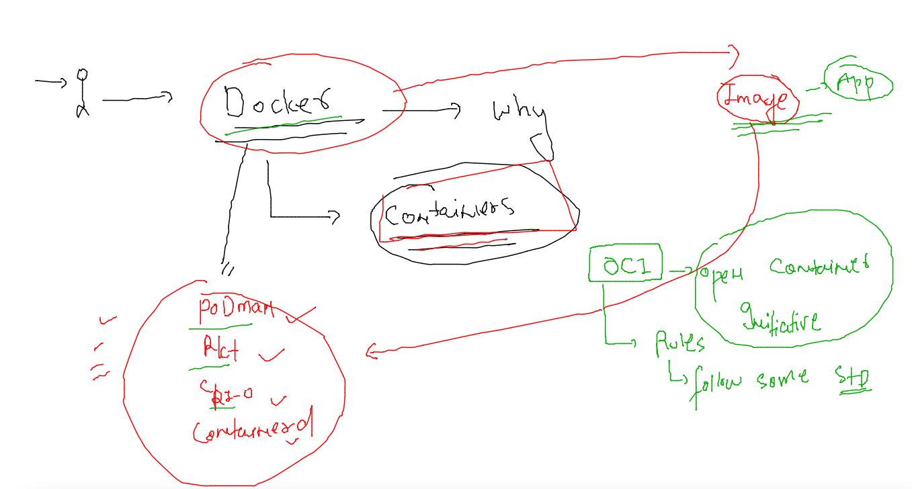
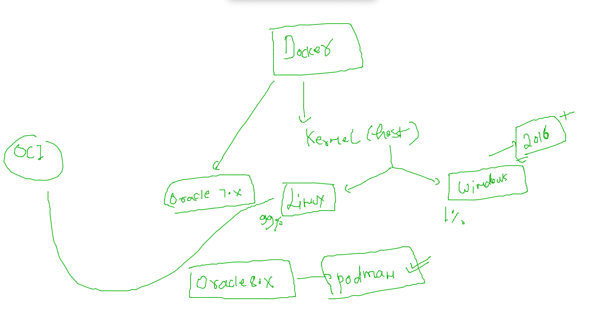
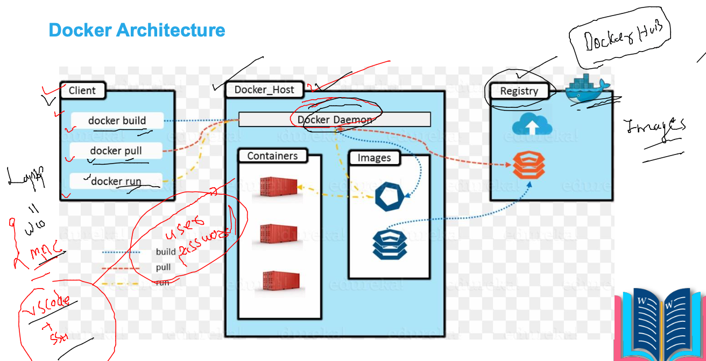
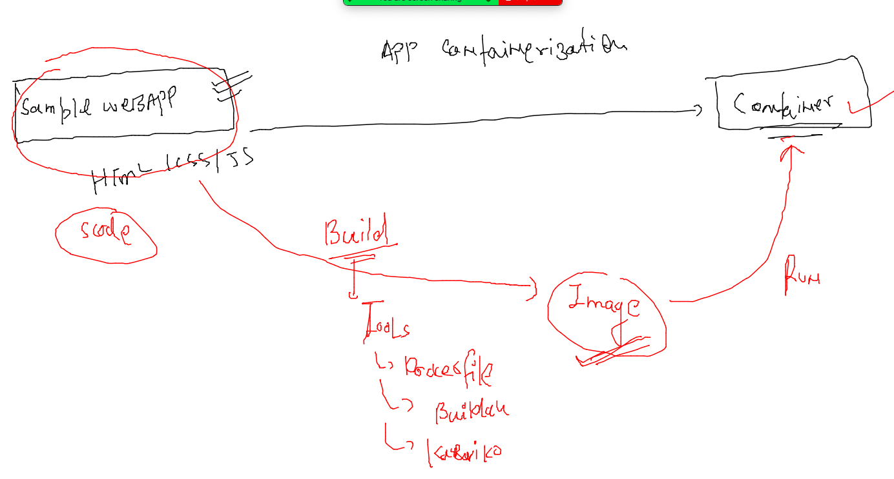

# training_plan 


## OCI (open container Initiative ) Understanding 



### lInk to read about OCI 

(Link)(https://opencontainers.org/)

## Installing docker in Linux Host 



### Installing docker in aws linux on AWS cloud 

```
[root@ip-172-31-18-125 ~]# yum  install docker  -y  ; systemctl enable --now docker 
Failed to set locale, defaulting to C
Loaded plugins: extras_suggestions, langpacks, priorities, update-motd
Resolving Dependencies
--> Running transaction check
---> Package docker.x86_64 0:20.10.7-5.amzn2 will be installed
--> Processing Dependency: runc >= 1.0.0 for package: docker-20.10.7-5.amzn2.x86_64
--> Processing Dependency: libcgroup >= 0.40.rc1-5.15 for package: docker-20.10.7-5.amzn2.x86_64
--> Processing Dependency: containerd >= 1.3.2 for package: docker-20.10.7-5.amzn2.x86_64
--> Processing Dependency: pigz for
```

### ON OCI -- in oracle linux 7.9 

```
root@docker-linux-host1 ~]# yum  install docker -y   ; systemctl enable --now docker 
Failed to set locale, defaulting to C
Loaded plugins: langpacks, ulninfo
ol7_MySQL80                                                                                         | 3.0 kB  00:00:00     
ol7_MySQL80_connectors_community                                                                    | 2.9 kB  00:00:00     
ol7_MySQL80_tools_community                                                                         | 2.9 kB  00:00:00     
ol7_UEKR6                                                                                           | 3.0 kB  00:00:00     
ol7_addons                                                                                          | 3.0 kB  00:00:00     
ol7_ksplice                                                                                         | 3.0 kB  00:00:00     
ol7_latest                                                                                          | 3.6 kB  00:00:00     
ol7_oci_included         
```

### now checking installation 

```
root@docker-linux-host1 ~]# yum  install docker -y   ; systemctl enable --now docker 
Failed to set locale, defaulting to C
Loaded plugins: langpacks, ulninfo
ol7_MySQL80                                                                                         | 3.0 kB  00:00:00     
ol7_MySQL80_connectors_community                                                                    | 2.9 kB  00:00:00     
ol7_MySQL80_tools_community                                                                         | 2.9 kB  00:00:00     
ol7_UEKR6                                                                                           | 3.0 kB  00:00:00     
ol7_addons                                                                                          | 3.0 kB  00:00:00     
ol7_ksplice                                                                                         | 3.0 kB  00:00:00     
ol7_latest                                                                                          | 3.6 kB  00:00:00     
ol7_oci_included         
```

### login to OCI VM and using docker 

```
ssh  ashu@158.101.16.187                               
ashu@158.101.16.187's password: 
-bash: warning: setlocale: LC_CTYPE: cannot change locale (UTF-8): No such file or directory
[ashu@docker-linux-host1 ~]$ 
[ashu@docker-linux-host1 ~]$ 
[ashu@docker-linux-host1 ~]$ whoami
ashu
[ashu@docker-linux-host1 ~]$ docker  version 
Client: Docker Engine - Community
 Version:           19.03.11-ol
 API version:       1.40
 Go version:        go1.16.2
 Git commit:        9bb540d
 Built:             Fri Jul 23 01:33:55 2021
 OS/Arch:           linux/amd64
 Experimental:      false

```

### FROm client -- / dev / admin laptops we will be using vscode to connect docker and k8s 

### Download vscode link

[download](https://code.visualstudio.com/download)

### Docker. architecture 



## Some docker OPerations 

### pulling image from docker hub 

```
 docker  images
REPOSITORY          TAG                 IMAGE ID            CREATED             SIZE
[ashu@docker-linux-host1 ~]$ docker  pull  openjdk 
Using default tag: latest
Trying to pull repository docker.io/library/openjdk ... 
latest: Pulling from docker.io/library/openjdk
e4430e06691f: Pull complete 
99ce5342b806: Pull complete 
603e156f2a3d: Pull complete 
Digest: sha256:e914d4e97cc467f99befdc751e1fa1b6c9ec77fc9396caae2e37c48c9e44a681
Status: Downloaded newer image for openjdk:latest
openjdk:latest
[ashu@docker-linux-host1 ~]$ docker  images
REPOSITORY          TAG                 IMAGE ID            CREATED             SIZE
openjdk             latest              34aba91dbd13        3 weeks ago         471MB
```

### checking list of image in docker host 

```
[ashu@docker-linux-host1 ~]$ docker  images
REPOSITORY          TAG                 IMAGE ID            CREATED             SIZE
alpine              latest              0ac33e5f5afa        2 weeks ago         5.57MB
openjdk             latest              34aba91dbd13        3 weeks ago         471MB
```

### APP containerization 




