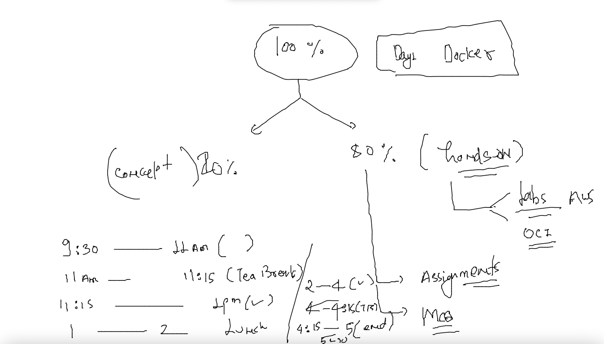
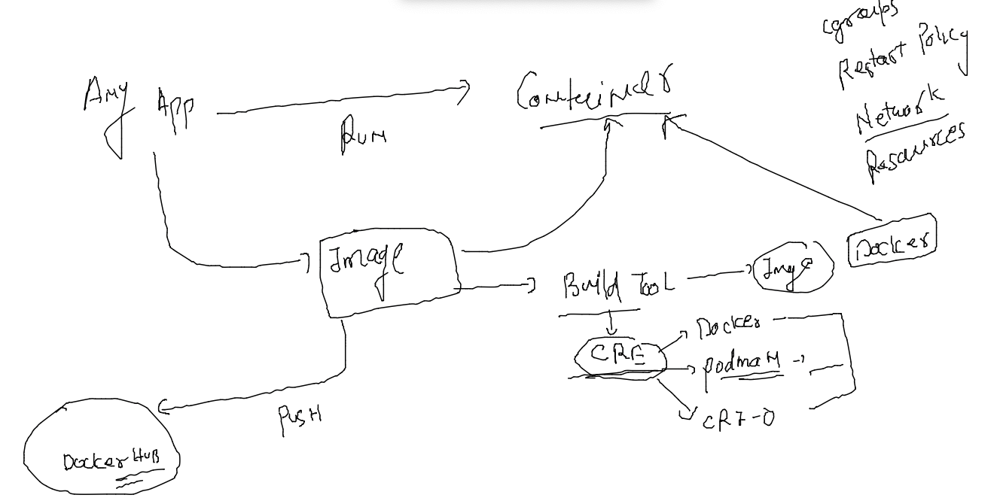
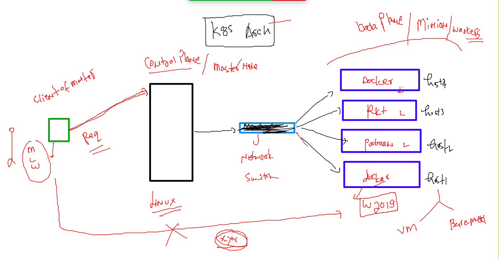
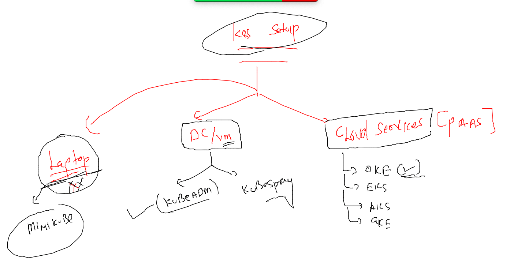

# training_plan 



### day1 revision 



### testing OCI standard 

```
[root@podman-host ~]# podman images
REPOSITORY  TAG         IMAGE ID    CREATED     SIZE
[root@podman-host ~]# podman pull  dockerashu/ashuwebapp/apr25v1
[root@podman-host ~]# podman pull  dockerashu/ashuwebapp/apr25v1
✔ docker.io/dockerashu/ashuwebapp/apr25v1:latest
Trying to pull docker.io/dockerashu/ashuwebapp/apr25v1:latest...
Error: initializing source docker://dockerashu/ashuwebapp/apr25v1:latest: reading manifest latest in docker.io/dockerashu/ashuwebapp/apr25v1: errors:
denied: requested access to the resource is denied
unauthorized: authentication required

[root@podman-host ~]# podman pull  docker.io/dockerashu/ashuwebapp:apr25v1
Trying to pull docker.io/dockerashu/ashuwebapp:apr25v1...
Getting image source signatures
Copying blob 32ace47e7ebf done  
Copying blob a4df6f21af84 done  
Copying blob 86d6207ad7cf done  
Copying config d9669ca17a done  
Writing manifest to image destination
Storing signatures
d9669ca17a853fe690e4027763f23ad1375c5dd25b3f5d31f7859f270c423a09
[root@podman-host ~]# podman images
REPOSITORY                       TAG         IMAGE ID      CREATED       SIZE
docker.io/dockerashu/ashuwebapp  apr25v1     d9669ca17a85  22 hours ago  427 MB
[root@podman-host ~]# podman run -itd  --name test1  -p 1133:80  d9669ca17a85
6103170a7b61a65b90fd4a2b7fa00e9b343f1c733497eeeba08abd83f87713cf
[root@podman-host ~]# podman ps
CONTAINER ID  IMAGE                                    COMMAND     CREATED        STATUS            PORTS                 NAMES
6103170a7b61  docker.io/dockerashu/ashuwebapp:apr25v1              4 seconds ago  Up 3 seconds ago  0.0.0.0:1133->80/tcp  test1
[root@podman-host ~]# 

```

### pushing image to OCIR 

```
 docker  tag  ashuwebapp:apr25v1   phx.ocir.io/axmbtg8judkl/oracleapp:v1 
[ashu@docker-linux-host1 ashu_docker_images]$ 
[ashu@docker-linux-host1 ashu_docker_images]$ 
[ashu@docker-linux-host1 ashu_docker_images]$ docker login  phx.ocir.io  
Username: axmbtg8judkl/learntechbyme@gmail.com
Password: 
WARNING! Your password will be stored unencrypted in /home/ashu/.docker/config.json.
Configure a credential helper to remove this warning. See
https://docs.docker.com/engine/reference/commandline/login/#credentials-store

Login Succeeded
[ashu@docker-linux-host1 ashu_docker_images]$ docker  push  phx.ocir.io/axmbtg8judkl/oracleapp:v1
The push refers to repository [phx.ocir.io/axmbtg8judkl/oracleapp]
32160d4b43c2: Pushed 
1698c557758b: Pushed 
2d3586eacb61: Pushing [=========================================>         ]  205.1MB/246.2MB

====

docker logout phx.ocir.io  
Removing login credentials for phx.ocir.io
[ashu@docker-linux-host1 ashu_docker_images]$ 

```

## to solve container Cluster problem -- we need k8s 

### architecture  -- 

### Level 1


### setup methods for k8s cluster 



### Installing kubeclt on client machine 

### On mac 

```
 curl -LO "https://dl.k8s.io/release/$(curl -L -s https://dl.k8s.io/release/stable.txt)/bin/darwin/amd64/kubectl"
  % Total    % Received % Xferd  Average Speed   Time    Time     Time  Current
                                 Dload  Upload   Total   Spent    Left  Speed
100   154  100   154    0     0    374      0 --:--:-- --:--:-- --:--:--   374
100 50.6M  100 50.6M    0     0  5077k      0  0:00:10  0:00:10 --:--:-- 6048k
fire@ashutoshhs-MacBook-Air ~ % chmod +x ./kubectl
fire@ashutoshhs-MacBook-Air ~ % sudo mv ./kubectl /usr/local/bin/kubectl
Password:
fire@ashutoshhs-MacBook-Air ~ % sudo chown root: /usr/local/bin/kubectl
fire@ashutoshhs-MacBook-Air ~ % 
fire@ashutoshhs-MacBook-Air ~ % kubectl  version --client
Client Version: version.Info{Major:"1", Minor:"23", GitVersion:"v1.23.6", GitCommit:"ad3338546da947756e8a88aa6822e9c11e7eac22", GitTreeState:"clean", BuildDate:"2022-04-14T08:49:13Z", GoVersion:"go1.17.9", Compiler:"gc", Platform:"darwin/amd64"}

```

### checking kubeconfig file to test k8s conection 

```

fire@ashutoshhs-MacBook-Air Desktop % kubectl   get  nodes  --kubeconfig admin.conf.txt 
NAME            STATUS   ROLES                  AGE   VERSION
control-plane   Ready    control-plane,master   9d    v1.23.5
node1           Ready    <none>                 9d    v1.23.5
fire@ashutoshhs-MacBook-Air Desktop % 
fire@ashutoshhs-MacBook-Air Desktop % 
fire@ashutoshhs-MacBook-Air Desktop % kubectl  cluster-info   --kubeconfig admin.conf.txt 
Kubernetes control plane is running at https://18.211.91.213:6443
CoreDNS is running at https://18.211.91.213:6443/api/v1/namespaces/kube-system/services/kube-dns:dns/proxy

To further debug and diagnose cluster problems, use 'kubectl cluster-info dump'.
fire@ashutoshhs-MacBook-Air Desktop % 


```

### saving file to home directory by the name of config 

```
 
fire@ashutoshhs-MacBook-Air Desktop % mkdir  ~/.kube
mkdir: /Users/fire/.kube: File exists
fire@ashutoshhs-MacBook-Air Desktop % cp  admin.conf.txt  ~/.kube/config 
fire@ashutoshhs-MacBook-Air Desktop % 
fire@ashutoshhs-MacBook-Air Desktop % kubectl  get nodes
NAME            STATUS   ROLES                  AGE   VERSION
control-plane   Ready    control-plane,master   9d    v1.23.5
node1           Ready    <none>                 9d    v1.23.5
```


