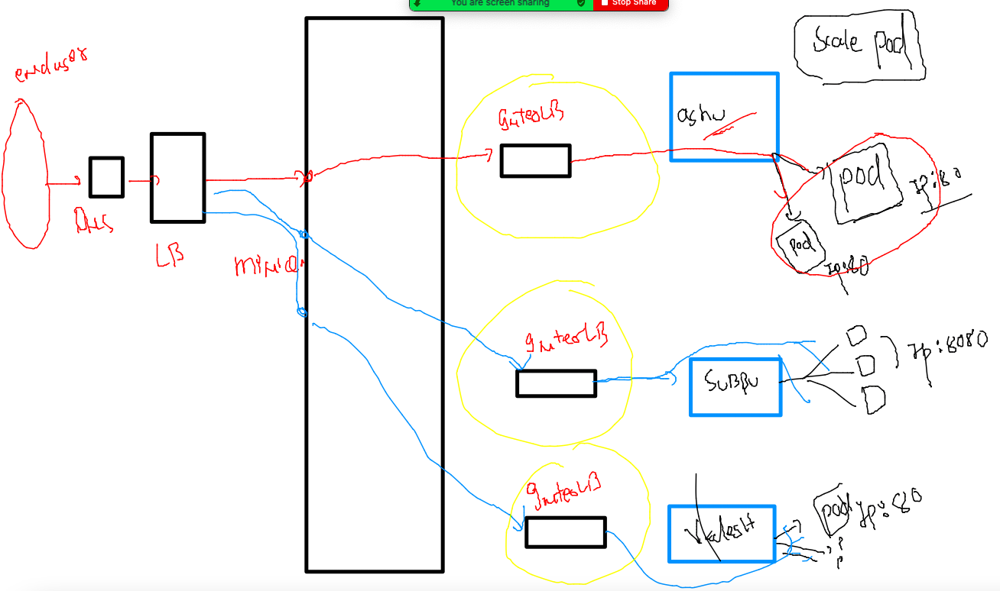
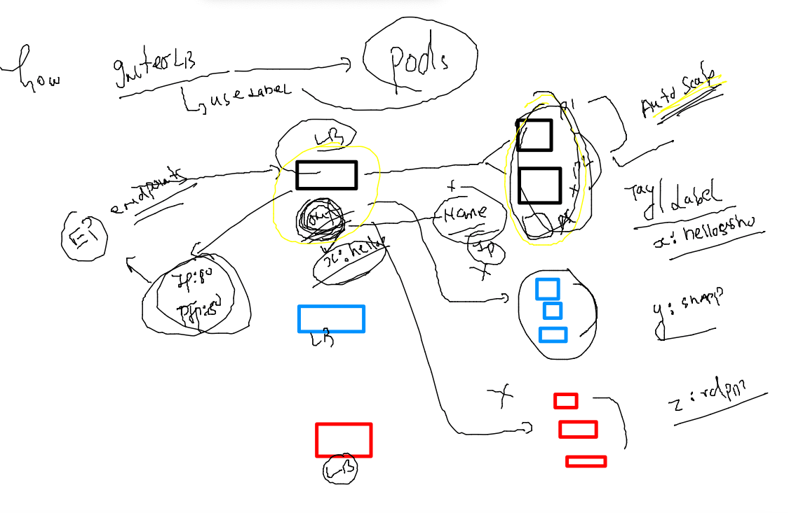

# training_plan 


### kubernetes namepsace resources deletion 

```
kubectl  get  all
No resources found in ashu-oci namespace.
fire@ashutoshhs-MacBook-Air ~ % kubectl  delete all --all
No resources found
fire@ashutoshhs-MacBook-Air ~ % 

```

### MULTI stage dockerfile 

### dockerfile with java app example 

```
FROM oraclelinux:8.4 AS Stage1 
LABEL email=ashutoshh@linux.com
RUN yum  install java-1.8.0-openjdk.x86_64 java-1.8.0-openjdk-devel.x86_64 maven  -y  ## layer ID 3453094545
COPY  . /javaweb/
WORKDIR /javaweb
RUN mvn clean package 
# above step for building javawebapp to .war file 

FROM tomcat 
LABEL name=ashutoshh
COPY --from=Stage1  /javaweb/target/WebApp.war /usr/local/tomcat/webapps/
# default location for java apps
EXPOSE 8080
```
### k8s networking again 
### deploy pod in personal namespace 
```
kubectl  create  -f  auto.yaml 
pod/ashupod555 created
fire@ashutoshhs-MacBook-Air k8s_app_deploy % kubectl  get  pods
NAME         READY   STATUS    RESTARTS   AGE
ashupod555   1/1     Running   0          5s
fire@ashutoshhs-MacBook-Air k8s_app_deploy % kubectl  get  pods -owide
NAME         READY   STATUS    RESTARTS   AGE   IP                NODE      NOMINATED NODE   READINESS GATES
ashupod555   1/1     Running   0          14s   192.168.179.246   minion2   <none>           <none>
fire@ashutoshhs-MacBook-Air k8s_app_deploy % 


```

### creating access pod to test internal networking 

```
kubectl  create  ns  app-access 
namespace/app-access created
fire@ashutoshhs-MacBook-Air ~ % 
fire@ashutoshhs-MacBook-Air ~ % 
fire@ashutoshhs-MacBook-Air ~ % kubectl  run  app-client --image=busybox  --command sleep 1000000 -n  app-access
pod/app-client created
fire@ashutoshhs-MacBook-Air ~ % kubectl  get  po -n app-access 
NAME         READY   STATUS    RESTARTS   AGE
app-client   1/1     Running   0          9s
fire@ashutoshhs-MacBook-Air ~ % kubectl  -n app-access exec -it  app-client -- sh 
/ # 
/ # 
/ # curl http://192.168.179.246:80 
sh: curl: not found
/ # wget  http://192.168.179.246:80
Connecting to 192.168.179.246:80 (192.168.179.246:80)
saving to 'index.html'
index.html           100% |****************************************************************************|  2866  0:00:00 ETA
'index.html' saved
/ # 


```

## accessing pod application 

### case 1 :- from k8s client system 


###

```
kubectl  port-forward  ashupod555  1234:80 
Forwarding from 127.0.0.1:1234 -> 80
Forwarding from [::1]:1234 -> 80
Handling connection for 1234

```

### case2 👎  when application is access by non k8s engg 

### Intro to Internal LB inside k8s minion_nodes



### Internal Lb will be using label of app to find all related pods 



### checking and changing label of pod 

```
kubectl  get po 
NAME         READY   STATUS    RESTARTS   AGE
ashupod555   1/1     Running   0          23m
fire@ashutoshhs-MacBook-Air k8s_app_deploy % kubectl  get po  --show-labels
NAME         READY   STATUS    RESTARTS   AGE   LABELS
ashupod555   1/1     Running   0          23m   run=ashupod555
fire@ashutoshhs-MacBook-Air k8s_app_deploy % kubectl  get po  --show-labels
NAME         READY   STATUS    RESTARTS   AGE   LABELS
ashupod555   1/1     Running   0          24m   run=ashupod555
fire@ashutoshhs-MacBook-Air k8s_app_deploy % kubectl  create -f  auto.yaml 
Error from server (AlreadyExists): error when creating "auto.yaml": pods "ashupod555" already exists
fire@ashutoshhs-MacBook-Air k8s_app_deploy % kubectl  get po  --show-labels
NAME         READY   STATUS    RESTARTS   AGE   LABELS
ashupod555   1/1     Running   0          24m   run=ashupod555
fire@ashutoshhs-MacBook-Air k8s_app_deploy % kubectl  apply  -f  auto.yaml
Warning: resource pods/ashupod555 is missing the kubectl.kubernetes.io/last-applied-configuration annotation which is required by kubectl apply. kubectl apply should only be used on resources created declaratively by either kubectl create --save-config or kubectl apply. The missing annotation will be patched automatically.
pod/ashupod555 configured
fire@ashutoshhs-MacBook-Air k8s_app_deploy % kubectl  get po  --show-labels
NAME         READY   STATUS    RESTARTS   AGE   LABELS
ashupod555   1/1     Running   0          25m   run=ashupod555,x=helloashu
```


