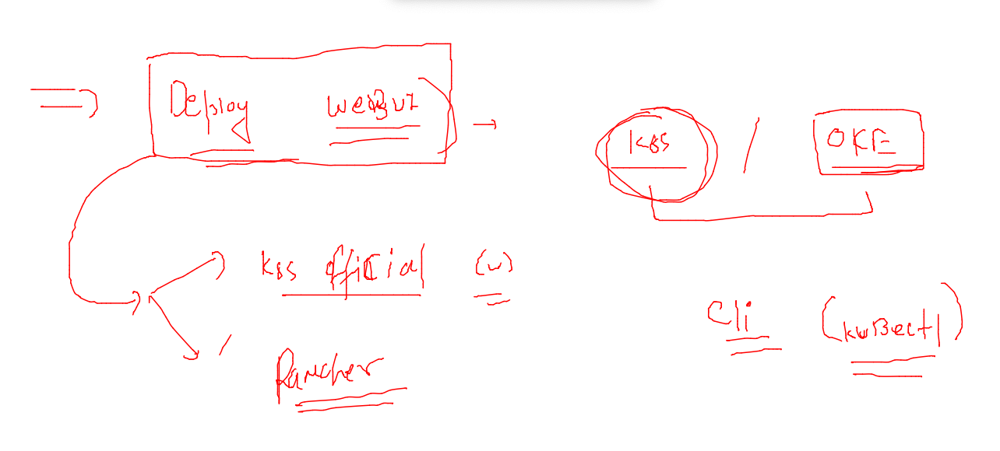

# training_plan 


### kubectl cheat sheet 

[cheat_sheet](https://kubernetes.io/docs/reference/kubectl/cheatsheet/)

### clean up namespace data

```
 kubectl  delete   all --all
pod "ashuapp-868fc9dfdf-6hvhm" deleted
pod "ashuapp-868fc9dfdf-qfrmz" deleted
service "s1" deleted
deployment.apps "ashuapp" deleted
horizontalpodautoscaler.autoscaling "ashuapp" deleted
```


### DNS in k8s 


### checking dns in k8s 

```
kubectl  get  pods -n kube-system   |   grep -i dns
coredns-64897985d-l872g                   1/1     Running   5 (17h ago)   11d
coredns-64897985d-ld4c9                   1/1     Running   5 (17h ago)   11d
```

## testing DNS in single namespace 

### deploy app using deployment 

```
kubectl  apply -f  deployment.yaml 
deployment.apps/ashuapp created
fire@ashutoshhs-MacBook-Air k8s_app_deploy % kubectl  get deploy 
NAME      READY   UP-TO-DATE   AVAILABLE   AGE
ashuapp   1/1     1            1           4s
fire@ashutoshhs-MacBook-Air k8s_app_deploy % kubectl  get  po -owide
NAME                       READY   STATUS    RESTARTS   AGE   IP               NODE      NOMINATED NODE   READINESS GATES
ashuapp-868fc9dfdf-s678j   1/1     Running   0          11s   192.168.50.216   minion3   <none>           <none>
fire@ashutoshhs-MacBook-Air k8s_app_deploy % 

```

### deploy nodeport / Loadbalancer svc 

```
 kubectl  get  deploy 
NAME      READY   UP-TO-DATE   AVAILABLE   AGE
ashuapp   1/1     1            1           3m51s
fire@ashutoshhs-MacBook-Air k8s_app_deploy % kubectl  expose deployment  ashuapp  --type NodePort  --port 1234 --target-port 80 --na
me  ashulb1 
service/ashulb1 exposed
fire@ashutoshhs-MacBook-Air k8s_app_deploy % kubectl  get  svc
NAME      TYPE       CLUSTER-IP     EXTERNAL-IP   PORT(S)          AGE
ashulb1   NodePort   10.96.160.47   <none>        1234:30394/TCP   52s
```
### testing access from Internal 

```
 kubectl  run  webclient --image=busybox --command sleep inf 
pod/webclient created
fire@ashutoshhs-MacBook-Air ~ % kubectl  get  po
NAME                       READY   STATUS    RESTARTS   AGE
ashuapp-868fc9dfdf-s678j   1/1     Running   0          7m30s
webclient                  1/1     Running   0          4s
fire@ashutoshhs-MacBook-Air ~ % 

```

### accessing page 

```
kubectl  exec  -it webclient -- sh 
/ # 
/ # wget  http://ashulb1 
Connecting to ashulb1 (10.96.160.47:80)
^C
/ # wget  http://ashulb1:1234 
Connecting to ashulb1:1234 (10.96.160.47:1234)
saving to 'index.html'
index.html           100% |****************************************************************************|  2866  0:00:00 ETA
'index.html' saved

```

### accessing svc from different namespace pod 

```

fire@ashutoshhs-MacBook-Air ~ % kubectl  run  webclient --image=busybox --command sleep inf  -n app-access 
pod/webclient created
fire@ashutoshhs-MacBook-Air ~ % 
fire@ashutoshhs-MacBook-Air ~ % kubectl  -n app-access exec -it  webclient -- sh 
/ # 
/ # wget http://ashulb
wget: bad address 'ashulb'
/ # wget http://ashulb1
wget: bad address 'ashulb1'
/ # 
/ # wget http://ashulb1
wget: bad address 'ashulb1'
/ # wget http://ashulb1.ashu-oci.svc.cluster.local
Connecting to ashulb1.ashu-oci.svc.cluster.local (10.96.116.145:80)
saving to 'index.html'
index.html           100% |****************************************************************************|  2866  0:00:00 ETA
'index.html' saved
/ # 
/ # cat  /etc/resolv.conf 
nameserver 10.96.0.10
search app-access.svc.cluster.local svc.cluster.local cluster.local ec2.internal
options ndots:5

```

### POD dns demo 

```
kubectl  -n app-access exec -it  webclient -- sh 

/ # 
/ # ping  192.168.50.216
PING 192.168.50.216 (192.168.50.216): 56 data bytes
64 bytes from 192.168.50.216: seq=0 ttl=63 time=0.540 ms
64 bytes from 192.168.50.216: seq=1 ttl=63 time=0.060 ms
^C
--- 192.168.50.216 ping statistics ---
2 packets transmitted, 2 packets received, 0% packet loss
round-trip min/avg/max = 0.060/0.300/0.540 ms
/ # 
/ # 
/ # ping  192-168-50-216.ashu-oci.pod.cluster.local
PING 192-168-50-216.ashu-oci.pod.cluster.local (192.168.50.216): 56 data bytes
64 bytes from 192.168.50.216: seq=0 ttl=63 time=0.061 ms
64 bytes from 192.168.50.216: seq=1 ttl=63 time=0.081 ms
^C
--- 192-168-50-216.ashu-oci.pod.cluster.local ping statistics ---
2 packets transmitted, 2 packets received, 0% packet loss
round-trip min/avg/max = 0.061/0.071/0.081 ms

```

### Dashboard deployment in k8s 



### Deploy 
```
kubectl apply -f https://raw.githubusercontent.com/kubernetes/dashboard/v2.5.0/aio/deploy/recommended.yaml
namespace/kubernetes-dashboard created
serviceaccount/kubernetes-dashboard created
service/kubernetes-dashboard created
secret/kubernetes-dashboard-certs created
secret/kubernetes-dashboard-csrf created
secret/kubernetes-dashboard-key-holder created
configmap/kubernetes-dashboard-settings created
role.rbac.authorization.k8s.io/kubernetes-dashboard created
clusterrole.rbac.authorization.k8s.io/kubernetes-dashboard created
rolebinding.rbac.authorization.k8s.io/kubernetes-dashboard created
clusterrolebinding.rbac.authorization.k8s.io/kubernetes-dashboard created
deployment.apps/kubernetes-dashboard created
service/dashboard-metrics-scraper created
deployment.apps/dashboard-metrics-scraper created
```

### Verify dashboard 

```
kubectl  get deploy -n kubernetes-dashboard 
NAME                        READY   UP-TO-DATE   AVAILABLE   AGE
dashboard-metrics-scraper   1/1     1            1           82s
kubernetes-dashboard        1/1     1            1           83s
fire@ashutoshhs-MacBook-Air ~ % kubectl  get  po  -n kubernetes-dashboard 
NAME                                         READY   STATUS    RESTARTS   AGE
dashboard-metrics-scraper-799d786dbf-djhzm   1/1     Running   0          96s
kubernetes-dashboard-546cbc58cd-gv2jj        1/1     Running   0          97s
fire@ashutoshhs-MacBook-Air ~ % 
fire@ashutoshhs-MacBook-Air ~ % kubectl  get  svc  -n kubernetes-dashboard 
NAME                        TYPE        CLUSTER-IP      EXTERNAL-IP   PORT(S)    AGE
dashboard-metrics-scraper   ClusterIP   10.109.105.22   <none>        8000/TCP   106s
kubernetes-dashboard        ClusterIP   10.96.166.40    <none>        443/TCP    112s
fire@ashutoshhs-MacBook-Air ~ % kubectl  get  ep  -n kubernetes-dashboard 
NAME                        ENDPOINTS              AGE
dashboard-metrics-scraper   192.168.235.130:8000   113s
kubernetes-dashboard        192.168.235.129:8443   119s
fire@ashutoshhs-MacBook-Air ~ % 

```

### to access dashboard from outside k8s cluster we need to change service to NP / LB 

```
 kubectl edit  svc  kubernetes-dashboard   -n kubernetes-dashboard 
service/kubernetes-dashboard edited
fire@ashutoshhs-MacBook-Air ~ % 
fire@ashutoshhs-MacBook-Air ~ % kubectl  get  svc  -n kubernetes-dashboard                        
NAME                        TYPE        CLUSTER-IP      EXTERNAL-IP   PORT(S)         AGE
dashboard-metrics-scraper   ClusterIP   10.109.105.22   <none>        8000/TCP        3m50s
kubernetes-dashboard        NodePort    10.96.166.40    <none>        443:32479/TCP   3m56s
fire@ashutoshhs-MacBook-Air ~ % 


```

### get dashboard token using given method 

```
 kubectl  get  secret  -n kubernetes-dashboard 
NAME                               TYPE                                  DATA   AGE
default-token-282zv                kubernetes.io/service-account-token   3      25m
kubernetes-dashboard-certs         Opaque                                0      25m
kubernetes-dashboard-csrf          Opaque                                1      25m
kubernetes-dashboard-key-holder    Opaque                                2      25m
kubernetes-dashboard-token-km56d   kubernetes.io/service-account-token   3      25m
fire@ashutoshhs-MacBook-Air ~ % kubectl describe  secret kubernetes-dashboard-token-km56d   -n kubernetes-dashboard 
Name:         kubernetes-dashboard-token-km56d
Namespace:    kubernetes-dashboard
Labels:       <none>
Annotations:  kubernetes.io/service-account.name: kubernetes-dashboard
              kubernetes.io/service-account.uid: 55692ce7-0fe8-43f9-90b8-2cf13aea4198

Type:  kubernetes.io/service-account-token

Data
====
ca.crt:     1099 bytes
namespace:  20 bytes
token:      eyJhbGciOiJSUzI1NiIsImtpZCI6Ikc4Zmp5VERyUzFLRWpVMkdMMXBGM0haRXFNX2VYNGl4X1BzaGhzRFNySWcifQ.eyJpc3MiOiJrdWJlcm5ldGVzL3NlcnZpY2VhY2NvdW50Iiwia3ViZXJuZXRlcy5pby9zZXJ2aWNlYWNjb3VudC9uYW1lc3BhY2UiOiJrdWJlcm5ldGVzLWRhc2hib2FyZCIsImt1YmVybmV0ZXMuaW8vc2VydmljZWFjY291bnQvc2VjcmV0Lm5hbWUiOiJrdW
```

### give access permission to dashbaord 

```
kubectl create clusterrolebinding power --clusterrole=cluster-admin  --serviceaccount=kubernetes-dashboard:kubernetes-dashboard
```
### kubernetes service in cloud Model 


### cloud based 
```
1)$ kubectl get svc
NAME         TYPE        CLUSTER-IP      EXTERNAL-IP   PORT(S)        AGE
ashulb1      NodePort    10.96.202.115   <none>        80:31284/TCP   107s
kubernetes   ClusterIP   10.96.0.1       <none>        443/TCP        25m
learntechb@cloudshell:~ (us-phoenix-1)$ kubectl get nodes
NAME          STATUS   ROLES   AGE     VERSION
10.0.10.245   Ready    node    7m34s   v1.22.5
10.0.10.84    Ready    node    46s     v1.22.5
learntechb@cloudshell:~ (us-phoenix-1)$ kubectl expose deploy ashuapp1 --type LoadBalancer --port 80 --name ashulb2
service/ashulb2 exposed
learntechb@cloudshell:~ (us-phoenix-1)$ kubectl get svc
NAME         TYPE           CLUSTER-IP      EXTERNAL-IP   PORT(S)        AGE
ashulb1      NodePort       10.96.202.115   <none>        80:31284/TCP   2m27s
ashulb2      LoadBalancer   10.96.243.15    <pending>     80:31077/TCP   6s
kubernetes   ClusterIP      10.96.0.1       <none>        443/TCP        26m
learntechb@cloudshell:~ (us-phoenix-1)$ kubectl get svc
NAME         TYPE           CLUSTER-IP      EXTERNAL-IP     PORT(S)        AGE
ashulb1      NodePort       10.96.202.115   <none>          80:31284/TCP   3m10s
ashulb2      LoadBalancer   10.96.243.15    144.24.11.169   80:31077/TCP   49s
kubernetes   ClusterIP      10.96.0.1       <none>          443/TCP        26m
learntechb@cloudshell:~ (us-phoenix-1)$ kubectl cluster-info 
Kubernetes control plane is running at https://144.24.53.178:6443
CoreDNS is running at https://144.24.53.178:6443/api/v1/namespaces/kube-system/services/kube-dns:dns/proxy

To further debug and diagnose cluster problems, use 'kubectl cluster-info dump'.
```

### Loadbalancer service problem with huge set of applications 


### Deploy nginx ingress controller in OKE -- 

```
 kubectl apply -f https://raw.githubusercontent.com/kubernetes/ingress-nginx/controller-v1.2.0/deploy/static/provider/cloud/deploy.yaml
namespace/ingress-nginx created
serviceaccount/ingress-nginx created
serviceaccount/ingress-nginx-admission created
role.rbac.authorization.k8s.io/ingress-nginx created
role.rbac.authorization.k8s.io/ingress-nginx-admission created
clusterrole.rbac.authorization.k8s.io/ingress-nginx created
clusterrole.rbac.authorization.k8s.io/ingress-nginx-admission created
rolebinding.rbac.authorization.k8s.io/ingress-nginx created
rolebinding.rbac.authorization.k8s.io/ingress-nginx-admission created
clusterrolebinding.rbac.authorization.k8s.io/ingress-nginx created
clusterrolebinding.rbac.authorization.k8s.io/ingress-nginx-admission created
configmap/ingress-nginx-controller created
service/ingress-nginx-controller created
service/ingress-nginx-controller-admission created
deployment.apps/ingress-nginx-controller created
job.batch/ingress-nginx-admission-create created
job.batch/ingress-nginx-admission-patch created
ingressclass.networking.k8s.io/nginx created
validatingwebhookconfiguration.admissionregistration.k8s.io/ingress-nginx-admission created
learntechb@cloudshell:~ (us-phoenix-1)$ kubectl  get ns
NAME              STATUS   AGE
default           Active   131m
ingress-nginx     Active   11s
kube-node-lease   Active   131m
kube-public       Active   131m
kube-system       Active   131m
learntechb@cloudshell:~ (us-phoenix-1)$ kubectl  get all -n ingress-nginx 
NAME                                            READY   STATUS      RESTARTS   AGE
pod/ingress-nginx-admission-create--1-c6wbb     0/1     Completed   0          29s
pod/ingress-nginx-admission-patch--1-wpk9r      0/1     Completed   0          29s
pod/ingress-nginx-controller-5849c9f946-5bxc7   0/1     Running     0          29s

NAME                                         TYPE           CLUSTER-IP     EXTERNAL-IP   PORT(S)                      AGE
service/ingress-nginx-controller             LoadBalancer   10.96.58.157   <pending>     80:30290/TCP,443:30341/TCP   29s
service/ingress-nginx-controller-admission   ClusterIP      10.96.10.161   <none>        443/TCP                      29s

NAME                                       READY   UP-TO-DATE   AVAILABLE   AGE
deployment.apps/ingress-nginx-controller   0/1     1            0           29s

NAME                                                  DESIRED   CURRENT   READY   AGE
replicaset.apps/ingress-nginx-controller-5849c9f946   1         1         0       29s

NAME                                       COMPLETIONS   DURATION   AGE
job.batch/ingress-nginx-admission-create   1/1           4s         29s
job.batch/ingress-nginx-admission-patch    1/1           4s         29s
learntechb@cloudshell:~ (us-phoenix-1)$ 
```

### nginx ingress deployment URL 

[nginx_ingress](https://kubernetes.github.io/ingress-nginx/deploy/)


### Ingress rules 


### Implementing deploy with Ingress rules 

### creating deployment 

```
kubectl  create  deployment  ashu  --image=nginx --port 80
deployment.apps/ashu created
fire@ashutoshhs-MacBook-Air ~ % kubectl  get  deploy 
NAME   READY   UP-TO-DATE   AVAILABLE   AGE
ashu   1/1     1            1           8s
fire@ashutoshhs-MacBook-Air ~ % 

```

### creating Internal LB with clusterIP service 

```
kubectl  expose deploy  ashu  --type ClusterIP --port 80 --name ashulb1 
service/ashulb1 exposed
fire@ashutoshhs-MacBook-Air ~ % kubectl  get  svc
NAME      TYPE        CLUSTER-IP      EXTERNAL-IP   PORT(S)   AGE
ashulb1   ClusterIP   10.104.18.216   <none>        80/TCP    4s
```

### update webapp 

```
 kubectl  exec -it  ashu-5f7b657f5d-dkn9n  -- bash 
root@ashu-5f7b657f5d-dkn9n:/# 
root@ashu-5f7b657f5d-dkn9n:/# cd /usr/share/nginx/html/
root@ashu-5f7b657f5d-dkn9n:/usr/share/nginx/html# ls
50x.html  index.html
root@ashu-5f7b657f5d-dkn9n:/usr/share/nginx/html# echo "Hello i am ashutoshh page!!..(:"  >index.html 
echo "Hello i am ashutoshh pagels..(:"  >index.html 
root@ashu-5f7b657f5d-dkn9n:/usr/share/nginx/html# cat  index.html 
Hello i am ashutoshh pagels..(:
root@ashu-5f7b657f5d-dkn9n:/usr/share/nginx/html# exit
exit

```

### HPA as best usage 

```
kubectl  get deploy 
NAME   READY   UP-TO-DATE   AVAILABLE   AGE
ashu   1/1     1            1           7m
fire@ashutoshhs-MacBook-Air ~ % kubectl  autoscale  deploy ashu --min=1 --max=10 --cpu-percent=5
horizontalpodautoscaler.autoscaling/ashu autoscaled
fire@ashutoshhs-MacBook-Air ~ % kubectl  get  hpa
NAME   REFERENCE         TARGETS        MINPODS   MAXPODS   REPLICAS   AGE
ashu   Deployment/ashu   <unknown>/5%   1         10        1          16s
fire@ashutoshhs-MacBook-Air ~ % 


```

### write Ingress first rule 

```
kubectl apply -f ashuingress_rule.yaml 
ingress.networking.k8s.io/ashu-ingress-rule1 created
fire@ashutoshhs-MacBook-Air k8s_app_deploy % kubectl get ing
NAME                 CLASS   HOSTS                                                  ADDRESS   PORTS   AGE
ashu-ingress-rule1   nginx   ingresslb-apps-627550189.us-east-1.elb.amazonaws.com             80      6s
fire@ashutoshhs-MacBook-Air k8s_app_deploy % 

```

### final 

```
 kubectl  get deploy 
NAME   READY   UP-TO-DATE   AVAILABLE   AGE
ashu   1/1     1            1           21m
fire@ashutoshhs-MacBook-Air ~ % kubectl  get  po    
NAME                    READY   STATUS    RESTARTS   AGE
ashu-5f7b657f5d-dkn9n   1/1     Running   0          21m
fire@ashutoshhs-MacBook-Air ~ % kubectl  get  svc
NAME      TYPE        CLUSTER-IP      EXTERNAL-IP   PORT(S)   AGE
ashulb1   ClusterIP   10.104.18.216   <none>        80/TCP    20m
fire@ashutoshhs-MacBook-Air ~ % kubectl  get  hpa
NAME   REFERENCE         TARGETS        MINPODS   MAXPODS   REPLICAS   AGE
ashu   Deployment/ashu   <unknown>/5%   1         10        1          14m
fire@ashutoshhs-MacBook-Air ~ % kubectl  get  ing
NAME                 CLASS   HOSTS                                                  ADDRESS         PORTS   AGE
ashu-ingress-rule1   nginx   ingresslb-apps-627550189.us-east-1.elb.amazonaws.com   172.31.31.223   80      2m12s
fire@ashutoshhs-MacBook-Air ~ % 


```
### storgae in k8s 


### volumes and remote / local storage 


### testing hostPath type volume -- which will take storage from Minion Node

```
kubectl  run log-gen --image=alpine --dry-run=client -oyaml >loggen.yaml
fire@ashutoshhs-MacBook-Air k8s_app_deploy % kubectl apply -f  loggen.yaml 
pod/log-gen created
fire@ashutoshhs-MacBook-Air k8s_app_deploy % 

```
### checking logs 

```
 kubectl  get  po 
NAME      READY   STATUS    RESTARTS   AGE
log-gen   1/1     Running   0          46s
fire@ashutoshhs-MacBook-Air ~ % kubectl  exec  log-gen -- cat  /mnt/logs.txt 
hello i am container
hello i am container
hello i am container
hello i am container
hello i am container
hello i am container
hello i am container

```


