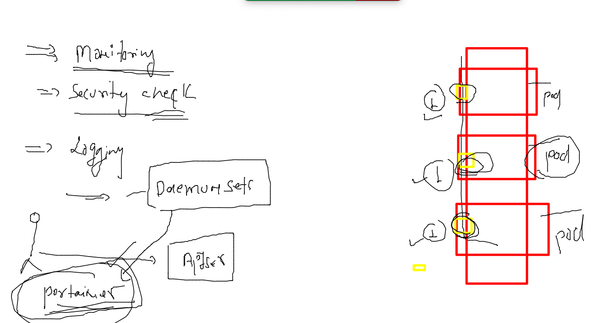

# training_plan 


## Two tier application deployment 


## Database mysql preparation 


### using secret to create and store db root account password 

```
 kubectl create  secret  generic  ashudb_cred  --from-literal  db_pass="Oracle098#?"    
   --dry-run=client -o yaml 
apiVersion: v1
data:
  db_pass: T3JhY2xlMDk4Iz8=
kind: Secret
metadata:
  creationTimestamp: null
  name: ashudb_cred
fire@ashutoshhs-MacBook-Air multi_tier_app % kubectl create  secret  generic  ashudb_cred  --from-literal  db_pass="Oracle098#?"       --dry-run=client -o yaml  >dbcred.yaml 
fire@ashutoshhs-MacBook-Air multi_tier_app % pwd
/Users/fire/Desktop/k8s_app_deploy/multi_tier_app
fire@ashutoshhs-MacBook-Air multi_tier_app % ls
dbcred.yaml

```

### creating pv and secret 

```
kubectl  apply -f  . 
secret/ashudb-cred created
persistentvolume/ashu-pv unchanged
fire@ashutoshhs-MacBook-Air multi_tier_app % ls
dbcred.yaml     nfspv.yaml
fire@ashutoshhs-MacBook-Air multi_tier_app % kubectl  get secret 
NAME                  TYPE                                  DATA   AGE
ashudb-cred           Opaque                                1      12s
default-token-zlcdf   kubernetes.io/service-account-token   3      2d17h
fire@ashutoshhs-MacBook-Air multi_tier_app % kubectl  get  pv    
NAME              CAPACITY   ACCESS MODES   RECLAIM POLICY   STATUS      CLAIM                     STORAGECLASS   REASON   AGE
ashu-pv           2Gi        RWO            Retain           Available                             manual                  44s
muskan-pv         2Gi        RWO            Retain           Available                             manual                  10s
mysql-pv          5Gi        RWO            Retain           Available                             manual                  24s
mysql-pv-volume   20Gi       RWO            Retain           Bound       muthu-ns/mysql-pv-claim   manual                  22h
santosh-pv        2Gi        RWO            Retain           Available   
```

### creating pvc 

```
 kubectl apply -f .
secret/ashudb-cred configured
persistentvolume/ashu-pv unchanged
persistentvolumeclaim/ashu-pvc created
fire@ashutoshhs-MacBook-Air multi_tier_app % kubectl  get  pvc
NAME       STATUS   VOLUME     CAPACITY   ACCESS MODES   STORAGECLASS   AGE
ashu-pvc   Bound    subbunfs   3Gi        RWO            manual         7s
fire@ashutoshhs-MacBook-Air multi_tier_app % 

```

### time to deploy DB pod using deployment 

```
 kubectl  apply -f . 
deployment.apps/ashudb created
secret/ashudb-cred configured
persistentvolume/ashu-pv unchanged
persistentvolumeclaim/ashu-pvc unchanged
fire@ashutoshhs-MacBook-Air multi_tier_app % kubectl  get deploy
NAME     READY   UP-TO-DATE   AVAILABLE   AGE
ashudb   1/1     1            1           12s
fire@ashutoshhs-MacBook-Air multi_tier_app % kubectl  get  po   
NAME                     READY   STATUS    RESTARTS   AGE
ashudb-98b8f59fc-gwgkf   1/1     Running   0          16s
fire@ashutoshhs-MacBook-Air multi_tier_app % 


```
### creating service for db deployment 
```
kubectl  get deploy
NAME     READY   UP-TO-DATE   AVAILABLE   AGE
ashudb   1/1     1            1           28m
fire@ashutoshhs-MacBook-Air multi_tier_app % kubectl expose deployment  ashudb  --type ClusterIP --port 3306  --name ashudbsvc1     
  --dry-run=client  -o yaml  >dbsvc.yaml 
```

###

```
kubectl  get deploy
NAME     READY   UP-TO-DATE   AVAILABLE   AGE
ashudb   1/1     1            1           28m
fire@ashutoshhs-MacBook-Air multi_tier_app % kubectl expose deployment  ashudb  --type ClusterIP --port 3306  --name ashudbsvc1     
  --dry-run=client  -o yaml  >dbsvc.yaml 
fire@ashutoshhs-MacBook-Air multi_tier_app % kubectl  get  svc
No resources found in ashu-oci namespace.
fire@ashutoshhs-MacBook-Air multi_tier_app % kubectl  apply -f dbsvc.yaml 
service/ashudbsvc1 created
fire@ashutoshhs-MacBook-Air multi_tier_app % kubectl  get  svc           
NAME         TYPE        CLUSTER-IP     EXTERNAL-IP   PORT(S)    AGE
ashudbsvc1   ClusterIP   10.97.226.27   <none>        3306/TCP   2s
```

### Now env creation for webapp pod 

### creating configMap which will store dbhost / URL 

```
 kubectl  create  configmap  ashudburl  --from-literal  dbhostname="ashudbsvc1" --dry-ru
n=client -o yaml >ashucm.yaml 
fire@ashutoshhs-MacBook-Air multi_tier_app % kubectl  apply -f ashucm.yaml 
configmap/ashudburl created
fire@ashutoshhs-MacBook-Air multi_tier_app % kubectl  get  cm
NAME               DATA   AGE
ashudburl          1      3s

```

### creating webapp 

```
 kubectl  apply -f  ashuwebapp.yaml 
deployment.apps/ashuwebapp created
fire@ashutoshhs-MacBook-Air multi_tier_app % kubectl  get deploy
NAME         READY   UP-TO-DATE   AVAILABLE   AGE
ashudb       1/1     1            1           44m
ashuwebapp   1/1     1            1           9s
fire@ashutoshhs-MacBook-Air multi_tier_app % kubectl  get  po   
NAME                         READY   STATUS    RESTARTS   AGE
ashudb-98b8f59fc-gwgkf       1/1     Running   0          44m
ashuwebapp-945d89585-j8nth   1/1     Running   0          13s
```

### creating service for webapp

```
 kubectl  get deploy
NAME         READY   UP-TO-DATE   AVAILABLE   AGE
ashudb       1/1     1            1           45m
ashuwebapp   1/1     1            1           68s
fire@ashutoshhs-MacBook-Air multi_tier_app % kubectl  expose deploy  ashuwebapp  --type NodePort --port 80 --name ashuwebsvc1 --dry-
run=client -o yaml  >websvc.yaml 
fire@ashutoshhs-MacBook-Air multi_tier_app % kubectl  apply -f websvc.yaml 
service/ashuwebsvc1 created
fire@ashutoshhs-MacBook-Air multi_tier_app % kubectl  get  svc
NAME          TYPE        CLUSTER-IP       EXTERNAL-IP   PORT(S)        AGE
ashudbsvc1    ClusterIP   10.97.226.27     <none>        3306/TCP       15m
ashuwebsvc1   NodePort    10.105.184.193   <none>        80:31435/TCP   3s

```

### users and RBAC in k8s 


## creating a custom namespace for particular user / customer 

### creating namespace and checking things 

```
kubectl  create  ns  project-1    
namespace/project-1 created
fire@ashutoshhs-MacBook-Air ~ % kubectl   get  serviceaccount -n  project-1
NAME      SECRETS   AGE
default   1         34s
fire@ashutoshhs-MacBook-Air ~ % kubectl   get  sa -n  project-1
NAME      SECRETS   AGE
default   1         47s
fire@ashutoshhs-MacBook-Air ~ % 
fire@ashutoshhs-MacBook-Air ~ % kubectl   get  secret -n  project-1
NAME                  TYPE                                  DATA   AGE
default-token-mw7mk   kubernetes.io/service-account-token   3      53s
fire@ashutoshhs-MacBook-Air ~ % kubectl describe   secret  default-token-mw7mk  -n  project-1
Name:         default-token-mw7mk
Namespace:    project-1
Labels:       <none>
Annotations:  kubernetes.io/service-account.name: default
              kubernetes.io/service-account.uid: 9d0650e8-f1e5-4f43-971a-3df326e3475b

Type:  kubernetes.io/service-account-token

Data

```

### lets check original config file 

```
kubectl  config  view
apiVersion: v1
clusters:
- cluster:
    certificate-authority-data: DATA+OMITTED
    server: https://18.211.91.213:6443
  name: kubernetes
contexts:
- context:
    cluster: kubernetes
    namespace: ashu-oci
    user: kubernetes-admin
  name: kubernetes-admin@kubernetes
current-context: kubernetes-admin@kubernetes
kind: Config
preferences: {}
users:
- name: kubernetes-admin
  user:
    client-certificate-data: REDACTED
    client-key-data: REDACTED

```

### new config file is not having any permission 

```
kubectl  get  nodes  --kubeconfig  custom_kubeconfig.yaml 
Error from server (Forbidden): nodes is forbidden: User "system:serviceaccount:project-1:default" cannot list resource "nodes" in API group "" at the cluster scope
fire@ashutoshhs-MacBook-Air k8s_app_deploy % kubectl cluster-info   --kubeconfig  custom_kubeconfig.yaml

To further debug and diagnose cluster problems, use 'kubectl cluster-info dump'.
Error from server (Forbidden): services is forbidden: User "system:serviceaccount:project-1:default" cannot list resource "services" in API group "" in the namespace "kube-system"
fire@ashutoshhs-MacBook-Air k8s_app_deploy % kubectl config get-contexts   --kubeconfig  custom_kubeconfig.yaml
CURRENT   NAME          CLUSTER      AUTHINFO   NAMESPACE
*         ashu-access   kubernetes   default    project-1

```

### creating role to that namespace 

```
 kubectl  create  role   pod-svc-access --resource=pod --verb=get,list,create,delete --resource=service      --verb=get,list,create   -n  project-1 
role.rbac.authorization.k8s.io/pod-svc-access created
fire@ashutoshhs-MacBook-Air ~ % 
fire@ashutoshhs-MacBook-Air ~ % 
fire@ashutoshhs-MacBook-Air ~ % kubectl  get roles -n project-1
NAME             CREATED AT
pod-svc-access   2022-04-29T09:43:45Z
fire@ashutoshhs-MacBook-Air ~ % 
fire@ashutoshhs-MacBook-Air ~ % 
fire@ashutoshhs-MacBook-Air ~ % 
fire@ashutoshhs-MacBook-Air ~ % kubectl  create  role   ashurole2  --resource=pod --verb=get,list --resource=service      --verb=get,list,create,delete   -n  project-1
role.rbac.authorization.k8s.io/ashurole2 created
fire@ashutoshhs-MacBook-Air ~ % 
fire@ashutoshhs-MacBook-Air ~ % 
fire@ashutoshhs-MacBook-Air ~ % kubectl  get roles -n project-1
NAME             CREATED AT
ashurole2        2022-04-29T09:45:22Z
pod-svc-access   2022-04-29T09:43:45Z
fire@ashutoshhs-MacBook-Air ~ % 

```

### creating role binding with service account 

```
 kubectl  create  rolebinding ashubind1  --role=pod-svc-access  --serviceaccount=project-1:default -n project-1
rolebinding.rbac.authorization.k8s.io/ashubind1 created
fire@ashutoshhs-MacBook-Air ~ % 
fire@ashutoshhs-MacBook-Air ~ % kubectl  get roles -n project-1
NAME             CREATED AT
ashurole2        2022-04-29T09:45:22Z
pod-svc-access   2022-04-29T09:43:45Z
fire@ashutoshhs-MacBook-Air ~ % kubectl  get rolebinding -n project-1
NAME        ROLE                  AGE
ashubind1   Role/pod-svc-access   19s
fire@ashutoshhs-MacBook-Air ~ % 

```

### testing config file 

```
kubectl  get  nodes  --kubeconfig  custom_kubeconfig.yaml
Error from server (Forbidden): nodes is forbidden: User "system:serviceaccount:project-1:default" cannot list resource "nodes" in API group "" at the cluster scope
fire@ashutoshhs-MacBook-Air k8s_app_deploy % 
fire@ashutoshhs-MacBook-Air k8s_app_deploy % kubectl  get  pods  --kubeconfig  custom_kubeconfig.yaml
No resources found in project-1 namespace.
fire@ashutoshhs-MacBook-Air k8s_app_deploy % kubectl  get  svc  --kubeconfig  custom_kubeconfig.yaml
No resources found in project-1 namespace.
fire@ashutoshhs-MacBook-Air k8s_app_deploy % kubectl  get  ns  --kubeconfig  custom_kubeconfig.yaml
Error from server (Forbidden): namespaces is forbidden: User "system:serviceaccount:project-1:default" cannot list resource "namespaces" in API group "" at the cluster scope
fire@ashutoshhs-MacBook-Air k8s_app_deploy % kubectl  get  deploy  --kubeconfig  custom_kubeconfig.yaml
Error from server (Forbidden): deployments.apps is forbidden: User "system:serviceaccount:project-1:default" cannot list resource "deployments" in API group "apps" in the namespace "project-1"
fire@ashutoshhs-MacBook-Air k8s_app_deploy % 

```

### Daemonset 



### 
```
kubectl apply -f ds.yaml 
daemonset.apps/ashu-container-monitoring created
fire@ashutoshhs-MacBook-Air k8s_app_deploy % kubectl get  ds
NAME                        DESIRED   CURRENT   READY   UP-TO-DATE   AVAILABLE   NODE SELECTOR   AGE
ashu-container-monitoring   3         3         1       3            1           <none>          6s
fire@ashutoshhs-MacBook-Air k8s_app_deploy % kubectl  get  no
NAME            STATUS   ROLES                  AGE    VERSION
control-plane   Ready    control-plane,master   12d    v1.23.5
minion2         Ready    <none>                 3d4h   v1.23.6
minion3         Ready    <none>                 3d4h   v1.23.6
node1           Ready    <none>                 12d    v1.23.5
fire@ashutoshhs-MacBook-Air k8s_app_deploy % kubectl get  ds 
NAME                        DESIRED   CURRENT   READY   UP-TO-DATE   AVAILABLE   NODE SELECTOR   AGE
ashu-container-monitoring   3         3         3       3            3           <none>          17s
fire@ashutoshhs-MacBook-Air k8s_app_deploy % kubectl get  po
NAME                              READY   STATUS    RESTARTS   AGE
ashu-container-monitoring-cn4kh   1/1     Running   0          25s
ashu-container-monitoring-dcnzs   1/1     Running   0          25s
ashu-container-monitoring-lnr2r   1/1     Running   0          25s
fire@ashutoshhs-MacBook-Air k8s_app_deploy % kubectl get  po -o wide
NAME                              READY   STATUS    RESTARTS   AGE   IP                NODE      NOMINATED NODE   READINESS GATES
ashu-container-monitoring-cn4kh   1/1     Running   0          29s   192.168.179.255   minion2   <none>           <none>
ashu-container-monitoring-dcnzs   1/1     Running   0          29s   192.168.166.149   node1     <none>           <none>
ashu-container-monitoring-lnr2r   1/1     Running   0          29s   192.168.50.220    minion3   <none>           <none>
```
## HELM 

### adding repo 
```
helm repo add bitnami https://charts.bitnami.com/bitnami
```

### list repo 

```
helm repo ls
WARNING: Kubernetes configuration file is group-readable. This is insecure. Location: /Users/fire/.kube/config
WARNING: Kubernetes configuration file is world-readable. This is insecure. Location: /Users/fire/.kube/config
NAME                	URL                                    
bitnami             	https://charts.bitnami.com/bitnami     
elastic             	https://Helm.elastic.co                
kubernetes-dashboard	https://kubernetes.github.io/dashboard/
fire@ashutoshhs-MacBook-Air ~ % 

```

###  doing helm search 

```
 helm search repo nodejs              
WARNING: Kubernetes configuration file is group-readable. This is insecure. Location: /Users/fire/.kube/config
WARNING: Kubernetes configuration file is world-readable. This is insecure. Location: /Users/fire/.kube/config
NAME         	CHART VERSION	APP VERSION	DESCRIPTION                                       
bitnami/ghost	16.0.11      	4.36.3     	Ghost is an open source publishing platform des...
bitnami/mean 	6.1.2        	4.6.2      	DEPRECATED MEAN is a free and open-source JavaS...
bitnami/node 	17.0.2       	16.14.0    	Node.js is a runtime environment built on V8 Ja...
fire@ashutoshhs-MacBook-Air ~ % helm search repo mysql 
WARNING: Kubernetes configuration file is group-readable. This is insecure. Location: /Users/fire/.kube/config
WARNING: Kubernetes configuration file is world-readable. This is insecure. Location: /Users/fire/.kube/config
NAME                   	CHART VERSION	APP VERSION	DESCRIPTION                                       
bitnami/mysql          	8.8.25       	8.0.28     	MySQL is a fast, reliable, scalable, and easy t...
bitnami/phpmyadmin     	9.0.6        	5.1.3      	phpMyAdmin is a free software tool written in P...
bitnami/mariadb        	10.3.6       	10.5.15    	MariaDB is an open source, community-developed ...
bitnami/mariadb-cluster	1.0.2        	10.2.14    	DEPRECATED Chart to create a Highly available M...
bitnami/mariadb-galera 	7.0.4        	10.6.7     	MariaDB Galera is a multi-master database clust...
```


